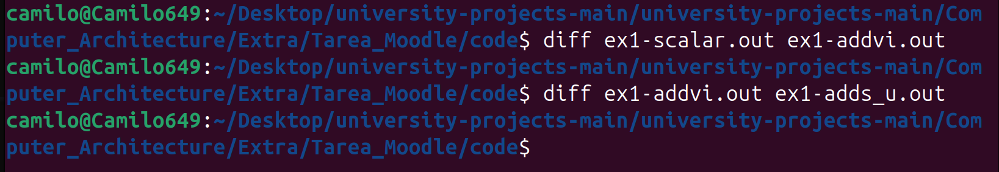
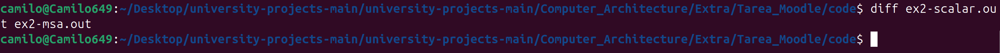

# Curso Extracurricular: Arquitecturas de Alto Rendimiento

- **Autor:** Camilo Gutiérrez
- **Profesor:** [Juan Antonio Clemente](https://scholar.google.es/citations?user=71ZyPn0AAAAJ&hl=en)

## 1. Preparación del Entorno

El completo desarrollo de esta tarea práctica se realizó en el sistema operativo LINUX, específicamente en la distribución Ubuntu 24.04.1 LTS. Por ello, siguiendo la guía de instalación del enunciado, solamente fue necesario instalar las siguientes dependencias:

- compilador GCC para arquitecturas MIPS ISA64 Release 6 (64 bits)
- simulador QEMU en modo de usuario

## 2. Ejercicio 1

Este ejercicio consiste en verificar que la ejecución de un algoritmo de tratamiento de imágenes devuelva los mismos resultados para las distintas versiones de codificación: **versión escalar** y las dos **versiones con MIPS MSA** (la que utiliza la instrucción `addvi.b` y la que utiliza `adds_u.b`). Más en detalle, el algortimo incrementa en 5 el píxel R (red) y lo satura a 255 si es necesario. El tamaño de la imágen es de 128x128 y cada píxel ocupa 1 byte en memoria.

>*NOTA: El código original se encuentra en el inciso a de este ejercicio.* 

Los comandos utilizados en todos los casos fueron los siguientes:

```sh
mipsisa64r6-linux-gnuabi64-gcc-10 -mmsa ex1.c -o <nombre_del_archivo_elf>.elf -static -<NOMBRE_DE_LA_MACRO>
```
que compila el código fuente del archivo `ex1.c` para la arquitectura MIPS64r6 dependiendo de la ausencia ó presencia de la macro y del valor de esta en el caso de que exista, y que además genera un archivo ejecutable (estático) .elf; y
```sh
qemu-mips64 -cpu I6400 <nombre_del_archivo_elf> > <nombre_del_archivo_out>.out
```
que utiliza QEMU para simular la ejecución del archivo .elf en un procesador I6400 y guarda su salida en un archivo .out.

>*NOTA: En el caso de que la macro se encuentre presente, los valores posibles para esta son: DADDVI_VERSION (para compilar el código del inciso b) y DADDS_VERSION (para compilar el código del inciso c).*

### a. Versión Escalar

Código a ejecutar:

``` c
for (i=0;i<16384;i++) {
    if (red[i]< 250)
        red[i] += 5;
    else
        red[i] = 255;
}
```
En este caso, el algoritmo itera linealmente todos los pixeles y les suma 5 o los satura a 255 si su valor en R es menor a 250. De todas formas, al momento de compilar el código, el compilador podría reescribirlo de manera que realice cómputo en paralelo empleando para ello vectores.

### b. Versión con MIPS MSA (utilizando addvi.b)

Código a ejecutar:

``` asm
__asm volatile(
"				li	 		$4,0x4000	\n"
"				move		$5,%[Red]	\n"
"				li	 		$6,0x10		\n"
"				ldi.b  		$w1,0xfa	\n"
"   			ldi.b		$w2,0xff	\n"
"loop: 			ld.b    	$w3,0($5)	\n"
"				clt_u.b 	$w4,$w3,$w1	\n"
"				addvi.b 	$w5,$w3,0x5	\n"
"   			bsel.v  	$w4,$w2,$w5 \n"
"				st.b    	$w4,0($5)	\n"
"				sub	 		$4,$4,$6	\n"
"				dadd    	$5,$5,$6	\n"
"				bgtz		$4,loop		\n"
"				nop						\n"
:
: [Red] "r" (red)
: "memory","$4","$5","$6"
);
```

Esta versión primero carga la cantidad de elementos del arreglo en `$4`, la posición de memoria donde comienza el arreglo en `$5`, la cantidad de elementos que se procesan por iteración en `$6` y las constantes 0xfa (250 en decimal) y 0xff (255 en decimal) en los registros vectoriales `w1` y `w2` respectivamente. Dentro del bucle, va trayendo grupos de elementos del arreglo y hace uso de las instrucciones `clt_u.b`, `addvi.b` y luego de `bsel.v` para ver si finalmente escribe Red[i] + 5 o 255 en la posición de memoria de cada píxel. Además, corre el puntero del arreglo en `$6` posiciones y decrementa `$4` en la misma cantidad para usar como condición de salida del bucle.

>*NOTA: Este código solo funciona si se cumple que `$4` es divisible por `$6`. En caso contrario, el código debería ser modificado para contemplar esta situación.*

### c. Versión con MIPS MSA (utilizando adds_u.b)

Código a ejecutar:

``` asm
__asm volatile(
"				li			$4,0x4000		\n"
"				li			$5,0x10			\n"
"				move		$6,%[Red]		\n"
"				ldi.b		$w0,0x5			\n"
"loop:			ld.b 		$w1,0($6)		\n"
"				adds_u.b 	$w1,$w1,$w0 	\n"
"				st.b   		$w1,0($6)		\n"
"				sub	 		$4,$4,$5		\n"
"				dadd    	$6,$6,$5		\n"
"				bgtz		$4,loop			\n"
"				nop							\n"
:
: [Red] "r" (red)
: "memory","$4","$5","$6"
);
```

Este último caso es muy similar al anterior, con la diferencia que aquí se emplea la instrucción `adds_u.b` tanto para comparar, incrementar 5 o actualizar el valor del píxel a 255. Esto es debido a que `adds_u.b` realiza la suma no signada normalmente a no ser que detecte *carry* en el bit más significativo y en cuyo caso satura el elemento del vector, i.e. lo escribe con 1s. Por lo tanto, este código resulta más eficiente que el anterior.

### Verificación

Los archivos generados durante la simulación fueron los siguientes:

- `ex1-scalar.out`
- `ex1-addvi.out`
- `ex1-adds_u.out`

Para asegurarnos que el resultado sea el mismo en todos los archivos, se hizo uso del comando [diff](https://linux.die.net/man/1/diff) del bash de Ubuntu.



Como podemos observar, no se detectó ninguna diferencia entres los archivos, lo que indica que las 3 versiones del códgio proujeron los mismos resultados.

## 3. Ejercicio 2

En este ejercicio, la tarea a concretar se basa en traducir código en C a MIPS 64 y posteriormente verificar su correcto funcionamiento. El código, detalla un algoritmo que ejecuta operaciones y comparaciones sobre 4 vectores de longitud 256 cuyos elementos son números en notación de punto flotante de 64 bits.

>*NOTA: El código original se encuentra en el inciso a de este ejercicio.* 

Similar al ejercicio anterior, haremos uso de macros para distinguir entre las diferentes versiones, siendo DMSA_VERSION el valor que debe estar presente en el comando para compilar el código del inciso b. Al igual que en el ejercicio anterior, la ausencia del nombre de una macro en la terminal genera la compilación del código del inciso a. Asimismo, los comandos utilizados para escribir los archivos .elf y .out, son los mismos que se emplearon anteriormente (ver ejercicio 2).

### a. Versión Escalar

Código a ejecutar:

``` c
for (i=0; i<256; i++) {
    a[i]=b[i]+c[i];
    if (a[i]==b[i])
        d[i]=a[i]*3;
    b[i]=a[i]-5;
}
```

Lo que el algoritmo pretende hacer es guardar en el vector `a` la suma de los vectores `b` y `c`, luego escribir en el elemento i-ésimo del vector `d` el triple del elemento i-ésimo de `a` sólo cuando este sea igual el elemento i-ésimo de `b` (que es lo mismo que hacerlo cuando el elemento i-ésimo de `c` sea 0), y por último, guarda en `b` el resultado de restarle 5 al vector `a`.

### b. Versión con MIPS MSA

Código a ejecutar:

``` asm
__asm volatile(
"		LD.D	$w7,0(%[Rthree])	\n"
"		LD.D	$w8,0(%[Rfive])		\n"
// YOUR CODE
"		LI      $4,0x100	        \n"
"       MOVE    $5,%[Ra]            \n"
"       MOVE    $6,%[Rb]            \n"
"       MOVE    $7,%[Rc]            \n"
"       MOVE    $8,%[Rd]            \n"
"		LI      $9,0x2	            \n"
"loop:  LD.D    $w1,0($6)           \n"
"       LD.D    $w2,0($7)           \n"
"       FADD.D  $w0,$w1,$w2         \n"
"       ST.D    $w0,0($5)           \n"
"       LD.D    $w4,0($8)           \n"
"       FCEQ.D  $w6,$w0,$w1         \n"
"       FMUL.D  $w5,$w0,$w7         \n"
"       BSEL.V  $w6,$w4,$w5         \n"
"       ST.D    $w6,0($8)           \n"
"       FSUB.D  $w0,$w0,$w8         \n"
"       ST.D    $w0,0($6)           \n"
"       SUB     $4,$4,$9            \n"
"       DADDIU  $5,$5,16            \n"
"		DADDIU  $6,$6,16	        \n"
"		DADDIU  $7,$7,16	        \n"
"		DADDIU  $8,$8,16	        \n"
"		BGTZ	$4,loop		        \n"
"		NOP							\n"
:
: [Ra] "r" (a),
  [Rb] "r" (b),
  [Rc] "r" (c),
  [Rd] "r" (d),
  [Rthree] "r" (three),
  [Rfive] "r" (five)
: "memory", "$4", "$5", "$6", "$7", "$8", "$9"
);
```

En esta versión, primero se cargan las constantes 3 y 5 en los vectores `w7` y `w8` respectivamente, la cantidad total de elementos de los arreglos en `$4` 0x100 (256 en decimal), las direcciones iniciales en memoria de los vectores `a`, `b`, `c` y `d` en `$5`, `$6`, `$7` y `$8` respectivamente, y por último la cantidad de elementos que se procesan por iteración en `$9` 0x2 (2 en decimal). Dentro del loop, se leen partes de los arreglos `b`, `c` y `d` (no hace falta leer `a` puesto que ya tenemos el valor de sus elementos en el vector `w0`), y escribimos en `a`, `b`, y `d` (este último solo se escribe cuando sea necesario aunque de igual forma siempre se calcula la multiplicación en cada iteración). También se desplazan los vectores y se decrementa `$4` en `$9` para mantener la consistencia de cada iteración. La setencia *if* se implementa haciendo uso de las operaciones `FCEQ.D` y `BSEL.V` determinando así correctamente si `d` debe mantener su valor original o escribirse con el valor a[i] * 3.

>*NOTA: `$4` debe ser un valor par para que algoritmo funcione correctamente.*

>*NOTA: Una implementación alternativa podría optar por utilizar saltos (branchs) en lugar de una máscara para el if.*

### Verificación

Los archivos generados durante la simulación fueron los siguientes:

- `ex2-scalar.out`
- `ex2-msa.out`

Al igual que en el ejercicio anterior, utilizaremos el comando `diff` para asegurarnos de que las salidas sean idénticas.



Dado que el contenido de ambos archivos es exacatamente el mismo, se concluye que la traducción a ensamblador es funcionalmente correcta.
markdown-pdf