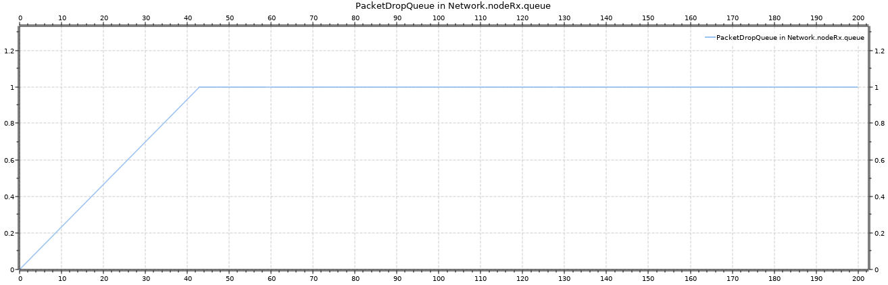

# Parte 1: Experimentos y Preguntas #

## Parámetros inamovibles ##

**Tiempo de Simulación** = 200s
**packetByteSize** = 12500B
**nodeTx.queue.bufferSize** = 2000000
**Network.queue.bufferSize** = 200
**nodeRx.queue.bufferSize** = 200

## Aclaraciones ##

- Fijamos un tamaño de búfer alto para el emisor para que este no sea un limitante ya que generalmente suele tener el contenido de sus paquetes cargados en memoria. 
- Por como estamos registrando los datos, el tamaño de un búfer en la gráfica nunca va a dar 0.
- En los gráficos, el eje X siempre es tiempo en segundos que corresponde al momento de la simulación.
- En los gráficos sobre búfers, el eje Y es la cantidad de paquetes.
- En los gráficos sobre demora, el eje Y representa tiempo en segundos de los paquetes que llegaron al sink (no aportan para esta métrica los paqutes dropeados). 

### Caso 1: Emisor 2 veces más rápido que Receptor ###

  

### generationInterval = exponential(0.1) ###

  Se llena el búfer receptor aproximadamente a los 42s de la simulación, por lo que en ese tiempo se comienzan a descartar
paquetes.
 
   

  El tamaño de la cola del network es siempre 1 porque salen y entran paquetes a la misma velocidad (0,1001s). Como nunca
alcanza su tamaño máximo (200), no dropea paquetes.
 
   

  El tamaño del búfer del emisor oscila entre 0 y 33 paquetes, esto debido a que su intervalo de generación se mantiene
alrededor de los 0,1s lo cual difere en promedio por tan solo 100 microsegundos de la demora que hay entre el out del nodo
Tx y el in de la cola de la red.
    

  La demora incrementa casi linealmente hasta el segundo 83 apróximadamente. El aumento de la demora en los primeros 42s es
clara, el búfer del receptor se va llenando eventualmente lo que hace que cada vez un nuevo paquete tenga que esperar a que
más paquetes se procesen. En el intervalo comprendido ente los 42s y los 83s, la demora está dada por lo que demoren los
paquetes que llegaron a guardarse en el búfer hasta que este se llenara pero que aún no fueron procesados. Como estos
tuvieron que esperar que se desencolen los paquetes que se generaron en el intervalo entre los 0 y 42 segundos, su demora va
a ir incrementando hasta que llega a un tope en aproximadamente 83s el cual está representando por el máximo tiempo que
puede esperar un paquete en nuestra red (¡Alrededor de 40s!). Ya que una vez que llega a la cola, si no es dropeado, deberá
esperar a que se procesen 199 paquetes antes que el. Las variaciones en estas demoras máximas se deben a que el parámetro de
generación de los paquetes varía en un radio exponencial de 0,1s. Notar que como el búfer del emisor recibe paquetes a una
velocidad de 0,1001s pero los desencola a una velocidad de 0,2s, el tiempo en que la demora alcanza su tope es es masomenos
el doble de lo que demora el la cola del receptor en llenarse.
 

  Como se puede ver en el gráfico subyacente, la red no esta muy congestionada puesto que solamente hay 10 paquetes viajando
(ya sea que se estén transmitiendo o estén almacenados en búferes) al momento de terminar la simulación, por lo que todo
parece indicar que el cuello de botella está en el receptor. Su búfer de datos termina completamente lleno al final dando a
entender que él es el responsable de los paquetes descartados.

### generationInterval = exponential(1) ###

  Como ahora el intervalo de generación es en promedio 5 veces mayor que lo que demora la cola del receptor en procesar un
paquete (0,2s), solo llega a encolar, a lo sumo, 1 paquete porque siempre puede desencolarlo antes de que llegue el
siguiente. Así el tamaño del búfer no regista un tamaño distinto de 1 y por ende no dropea paquetes.
 
 

  Respecto a la cola de la red su comportamineto y gráfico no varían para este caso, puesto que no hemos realizado
modificaciones que le afecten.

  Al tener una velocidad de generación de paquetes aproximadamente en promedio 10 veces mayor a lo que demora el paquete en
viajar desde desde la cola del emisor hasta la cola del network, el tamaño del búfer a duras penas puede ser mayor que 1
(para que esto suceda, necesitamos que un paquete se mande en menor de 0,1001s, lo cual es poco probable). Notar que si este
fenómeno sucede  una sola vez, es decir el búfer emisor llega a tener tamaño 2 y no más, esto no afecta al tamaño del búfer
del emisor como se refleja en su gráfica, puesto que como el búfer no tiene a nadie en la cola cuando llegar el primer
paquete puede mandarlo al resumidero en lo que llega el otro paquete y se encola para luego ser enviado.

  Con un intervalo de generación tan alto, la demora se mantiene la mayor parte del tiempo en lo mínimo que puede llegar a
tardar un paquete en nuestra red (0,4002s = 2* 0,1001s (tiempo en red) + 0,2s (tiempo en la cola del receptor)). Notar que
la máxima demora se corresponde al momento en el que el búfer del emisor estuvo con tamaño 2, pues el segundo paquete llegó
a la cola del receptor cuando al primer paquete le faltaban cerca de 0,3 segundos para enviarse (de ahí que se registre una
demora superior a la mínima en un poco más de 0,3 segundos).
  

  Para este caso, no hay problemas observables en lo que a pérdida de paquetes se refiere. De los 200 paquetes que se
crearon, los 200 paquetes llegaron a destino casi a la misma velocidad que se generaon puesto que solo faltaba de procesar
1 paquete al momento de terminar la simulación.

### Caso 2: La Red va lenta ###

 

### generationInterval = exponential(0.1) ###

  Como a cada paquete le toma mínimo 0,3002s en llegar a la cola del receptor y esta desencola a una velocidad de 0,1s,
prácticamente no tiene uso pues nunca va a tener más de un paquete a la vez y por lo tanto tampoco descartará paquetes.
 
 

  Tenemos que aproximadamente al segundo 42 la cola de la red esta llena por completo y empieza a dropear paquetes. Todo
esto gracias a que recibe paquetes casi el doble de rápido de lo que puede desencolarlos.
 

  El comportamiento y gráfico del emisro son idénticos al del caso 1 puesto que no cambiamos algo que pudiese afectar al
nodo Tx.

  Con la demora sucede lo mismo que en el caso 1 solo que ahora el causante es el búfer de la red y no el del receptor.

  En el gráfico de abajo, podemos observar una gráfica parecida a la del caso 1 para esta misma distribución exponencial de
generación en cuanto a cantidad de paquetes usados y descartados se refiere. La importante diferencia es que el 
búfer del receptor terminó casi holgado pasados los 200 segundos, mientras que aumentó considerablemente la cantidad de 
paquetes en camino. Para la pequeña network que estamos estudiando, lo más probable es que se hayan quedado muchos paquetes estancados en el búfer de la red y que sea esta la razón de los paquetes dropeados.

### generationInterval = exponential(1) ###

  Como era de esperarse, aumetar en promedio la tasa de generación de paquetes no va a hacer que un paquete demore menos en
atravesar la red, por lo tanto, estamos parados en la misma situación que cuando la tasa de generación era más chica
¡Estamos desaprovechando la capacidad del búfer del emisor!

  Con un intervalo de generación más alto, ahora la cola de la red no tiene los mismos problemas que antes. Se necesitaría
que al menos 3 paquetes fueran generados de forma tal que la diferencia de creación entre el primero y el último sea menor a
0,1001s, algo muy poco probable, para que el búfer logre tener más de un paquete a la vez. Si bien sucede el mismo fenómeno
en la cola del emisor que en el caso 1 para un intervalo de generación grande, no afecta al tamaño del búfer de red a lo
largo de la simulación de la misma forma en la que no lo hacía para el búfer del emisor cuando vimos el caso 1.
 

 Idem caso 1 para el búfer del emisor.
 Lo mismo que sucede en el caso 1 para un intervalo de generación alto sucede para este caso. La única diferencia es que 
la poca demora es generada por la red y no por el emisor.
 Si hicieramos un gráfico de torta como lo veníamos haciendo en los otros casos, observaríamos el mismo comportamiento que 
se daba para el caso 1 con una distribución exponencial de 1 para la generación de paquetes. Puesto que no habrían problemas 
observables, gracias a que se generan paquetes mucho más lento de lo que estos demoran en viajar po cualquiera de las
conexiones.

## Conclusiones Parte 1##

  Tanto un emisor veloz y un receptor lento (caso 1) como una red lenta (caso 2) son capaces de generar las mismas demoras.
La diferencia radica en donde se encuentra el cuello de botella. Para el caso 1, este se encuentra en el receptor; para el
caso 2, este se encuentra en la red.
  ¿Cómo puede hacer la capa de transporte, que no conoce los detalles de la red, para eludir o al menos disminuir estas
demoras? Cuando tenemos un emisor más rapido que el receptor, esto provocará un rápido llenado de la cola del receptor lo
que deriva en paquetes descartados. Aquí hablamos del problema de **control de flujo**. Para evitar esto, el emisor debe
adecuar su flujo, es decir la cantidad de paquetes enviados, a la capacidad del receptor. Este enfoque intenta aprovechar al
máximo la limitante dada por la velocidad de procesamiento del receptor.
  Cuando resulta que la tardanza o pérdida de los paquetes suceden en la red, estamos hablando del problema de **control de
congestión**. Para mejorar esta situación, el emisor tiene que acomodar su tasa de envió de paquetes a la situación de la
red, enviando cargas grandes cuando esta vaya bien o disminuyendo las cargas con la motivación de descongestionar la red.
Este enfoque intenta aprovechar al máximo la limitante dada por la velocidad de la red.

---

# Parte 2: Método #

  El primer paso para establecer una solución a estos problemas fue establecer una premisa sobre la cual trabajar. La premisa
que tomamos fue acorde a lo aprendimos en el teorico, la capa de transporte regula la tasa de transferencia de paquetes en
base a información que obtiene de la red y del receptor con el fin de no perder paquetes al mismo tiempo que optimiza el 
flujo de principio a fin para no perder capacidad de carga.
  En base a esto y tomando la estructura y parte de la implementación de la parte uno, definimos un método que intenta poner
en funcionamiento lo establecido en la premisa. En primer lugar necesitamos poder informar al nodo emisor de nuestra red la
capacidad restante tanto de la red como del nodo receptor. Para esto utilizamos unos paquetes nuevos llamados
FeedbackPacket. En base a estos paquetes que recibe el nodo emisor, este puede regular (aumentar o disminuir) la tasa de
envío de paquetes que son depositados en la red para evitar la pérdida de estos y también para aprovechar al máximo la
capacidad de la red. 
  Resumiendo, la utilidad de estos paquetes es:

* **Envío de FeedbackPacket:** Se envía un FeedbackPacket desde el nodo receptor al nodo emisor después de procesar cada paquete de datos, informando sobre la capacidad restante de la red.

* **Ajuste de la velocidad de envío:** El nodo emisor ajusta dinámicamente su velocidad de envío de paquetes en función de la información recibida desde los FeedbackPackets, evitando la congestión. Establecimos dos umbrales que cumplen este propósito.

* **UpperThreshold:** Este umbral representa el límite superior a considerar tanto de la capacidad de la red como la del emisor. Nos pareció conveniente asignarle un valor del 80% del tamaño del búfer del receptor. Cuando la capacidad restante de la cola a considerar, según lo informado en el FeedbackPacket, supera o iguala este umbral, el nodo emisor aumenta su velocidad de envío de paquetes en un 10%.

* **LowerThreshold:** Este umbral representa el límite inferior a considerar tanto de la capacidad de la red como la del emisor. Decidimos asignarle un valor del 20% del tamaño del búfer del receptor. En el momento en que la capacidad restante de la cola a considerar cae por debajo de este umbral o lo iguala, la capa de transporte del emisor reduce su velocidad en un 10%. Esto ayuda a mantener un flujo de datos eficiente al garantizar que el nodo emisor utilice la capacidad disponible de manera óptima.

  A continuación presentaremos un breve resumen de los cambios en la implementación original.

## Implementación ##

#### Clase Queue: ####

  Esta clase representa una cola de paquetes. Es la queue_0 y queue_1 de nuestra simulación.

**Variables miembro:**  
bufferSizeQueue, packetDropQueue: Vectores de salida para registrar el tamaño de la cola y el número de paquetes descartados, respectivamente. 
_packetDropped:_ Contador de paquetes descartados. 
_buffer:_ Cola de paquetes. 
_endServiceEvent:_ Evento utilizado para programar el próximo envío de un paquete. 
_serviceTime:_ Tiempo de servicio para cada paquete. 

**Funciones miembro:** 
_initialize():_ Inicializa la cola y otros parámetros. 
_handleMessage(msg):_ Maneja los diferentes tipos de mensajes que pueden llegar a la cola, como paquetes de datos, 
solicitudes de conexión y paquetes de retroalimentación. 

#### Clase TransportTx (Transmisor de Transporte): ####

  Esta clase hereda de Queue y representa un nodo transmisor en la network.

**Variables miembro:** 
_Connected:_ Indica si la conexión con el receptor está establecida. Decidimos no considerar que la conexión finaliza para los casos de estudio, por lo que no se implementa una forma de terminarla. 
_UpperThreshold, LowerThreshold_: Umbrales utilizados para ajustar la velocidad de envío. 
_TimeModifier:_ Factor utilizado para ajustar la velocidad de envío. 
**Funciones miembro:** 
_initialize():_ Inicializa las variables. 
_handleMessage(msg):_ Maneja los mensajes específicos del transmisor, como solicitudes de conexión y paquetes de retroalimentación. 

#### Clase TransportRx (Receptor de Transporte): ####

  Esta clase también hereda de Queue y representa un nodo receptor en la network.

**Variables miembro:** 
_CR:_ Objeto de solicitud de conexión. 
_fdb:_ Objeto de paquete de retroalimentación. 
_packetReceivedVector:_ Vector de salida para registrar el número de paquetes recibidos. 
_minNetworkCapacity:_ Capacidad mínima de la red. 

**Funciones miembro:** 
_initialize():_ Inicializa las variables y envía una solicitud de conexión al inicio de la simulación. 
_handleMessage(msg):_ Maneja los mensajes específicos del receptor, como paquetes de datos y respuestas a solicitudes de conexión. 

  Por último, las clases Generator y Sink básicamente son muy similares a la parte uno de este proyecto salvo el
agregado de algunas variables para las métricas.

  En resumen, este código simula el comportamiento de un sistema de transmisión y recepción de paquetes en una red, con
mecanismos para controlar la congestión tanto en el nodo receptor como en la red en sí y ajustar dinámicamente la velocidad
de envío en función de la capacidad de la red como se mencionó en el apartado de método.
  En estas imágenes se puede ver reflejada la estructura de la red:

## Experimentos y Preguntas ##

Los análisis de los exprimentos los vamos a dividir en dos grupos de igual manera como se hizo en la parte uno de este
proyecto. El caso uno representa un nodo reeptor saturado y el caso dos representa un problema de congestión en la red
(en el nodo que se encuentra entre los nodos emisor y receptor).
  Las preguntas a responder en este apartado sería si nuestra implementación logró su objetivo de que no ocurra congestión de
paquetes en el nodo receptor y la posterior pérdida de los mismos. También deberíamos responder si logramos aprovechar la
máxima capacidad de la red en su totalidad.

### Parámetros inamovibles ###

**Tiempo de Simulación** = 200s 
**connectionRequestByteSize** = 20B 
**packetByteSize** = 12500B 
**feedbackPacketByteSize** = 20B 
**nodeTx.TrTx.Size** = 2000000 
**Network.queue.bufferSize** = 100 
**Network.queue.serviceTime** = exponential(0.1) 
**nodeRx.TrRx.Size** = 200 
**nodeRx.TrRx.serviceTime** = exponential(0.1) 

### Caso 1 - Control de Flujo ###

  Primero notar que la estructura de ambos bloques de mediciones es delay por un lado y nodeTx, queue_0 y nodeRx
correspondiente a los búfer de estos nodos.
  El gráfico principal que deberiamos mirar aca sería el del nodoRx, ya que el cuello de botella para este caso se encuentra
allí lo que nos podría ocasionar pérdidas de paquetes por existir congestión.
  Las variables para las mediciones del caso 1 fueron las siguientes:

nodeTx.out --> { datarate = 1Mbps; delay = 100us; } --> queue_0.in 
queue_0.out --> { datarate = 1Mbps; delay = 100us; } --> nodeRx.in 
TrRx.toApp --> { datarate = 0.5Mbps; } --> sink.in 

#### generationInterval = exponential(0.1) ####

/Delay.png)
/Tx.png)
/Queue0.png)
/Rx.png)

  Nuestra implementación tal como la pensamos logra que no se pierdan paquetes ya que al llegar al 80% del tamaño del búfer
cubierto inmediatamente comienza a disminuir la saturación, lo que quiere decir que de alguna manera ha llegado un feedback
al nodo emisor para disminuir la tasa de envío de paquetes por segundos. Ahora, si miramos el gráfico y la curva que hace el
nodo emisor podemos ver que disminuye la tasa de transferencia porque empieza a subir levemente la acumulación que sufre. 
Entonces podemos afirmar que en este caso vemos un resultado satisfactorio. Nuestra hipótesis también decía que nuestra 
implementación debería garantizar un buen uso de la capacidad de la red y esto no se cumple satisfactoriamente, porque en el 
nodo receptor vemos que al caer el tamaño de la cola por debajo del 20 por ciento no empieza a subir nuevamente dentro de 
los 200 segundos estudiados, lo que nos permite afirmar que la tasa de envío del nodo emisor no aumenta sino que
se mantiene exactamente igual a la tendencia que traía segundos antes. Esto también lo podemos ver en el gráfico del nodo 
emisor ya que no comienza a bajar la "congestión". El gráfico de delay (tiempo de viaje del paquete de principio a fin) se 
corresponde con lo expresado del análisis de los buffer, al principio va a en aumento hasta que se empieza a reducir la tasa 
de envío y empieza a caer drásticamente.

#### generationInterval = exponential(1) ####

/Delay.png)
/Tx.png)
/Queue0.png)
/Rx.png)

  Si miramos los gráficos podemos ver que la tasa de envío  del emisor en ningún momento aumenta al verificarse que el
búfer del nodo receptor siempre se encuentra por debajo del 20% cubierto. También vemos que prácticamente no hay delay 
varía solamente por el uso de parámetros con distribuciones exponenciales. Aún así todo esto tiene sentido porque la
generación de paquetes del nodo generator es demasiado alta. Aquí prácticamente no se aprecia, pero en un caso en el que
la generación de paquetes sea más alta pero que no llegue a generar problemas, veríamos una mejor curva de como disminuye
la cantidad de paquetes en transporTx debido al constante bajo uso de las capacidades de la red y del emisor.

### Caso 2 - Control de congestión ###

  Las preguntas a responder en este apartado también sería si nuestra implementación logró su objetivo de que no ocurra 
congestión de paquetes en el nodo queue_0 y la posterior pérdida de los mismos. También deberíamos responder si logramos 
aprovechar la máxima capacidad de la red.
  Primero notar que la estructura de ambos bloques de mediciones es idéntica a las primeras, delay por un lado y nodeTx, 
queue_0 y nodeRx correspondiente a los búfer de estos nodos.
  Las variables para las mediciones del caso 2 fueron las siguientes:

nodeTx.out --> { datarate = 1Mbps; delay = 100us; } --> queue_0.in 
queue_0.out --> { datarate = 0.5Mbps; delay = 100us; } --> nodeRx.in 
TrRx.toApp --> { datarate = 1Mbps; } --> sink.in 

  A continuación se presentan las mediciones obtenidas según los intervalos de generación propuestos:

#### generationInterval = exponential(0.1) ####

/Delay.png)
/Tx.png)
/Queue0.png)
/Rx.png)

  Para el intervalo de generación de exponencial(0.1) nuestra implementación del código evita pérdidas de 
paquetes pero igual que en el caso 1 no logra aprovechar la capacidad total de la red. Podemos ver que en el búfer del nodo 
queue_0 cuando está por llegar a su límite comienza a bajar rápidamente y en el mismo momento que experimenta esa baja 
también empieza a disminuir la tasa de envio del transportTx por lo que el algoritmo parece funcionar bien en ese 
sentido. Aunque, al bajar tanto la tasa de envío, sucede que alrededor del segundo 90 deja directamente de enviar paquetes a 
la red y se corta todo registro de los mismos hasta el final de la simulación. Esto estaría indicando que el emisor tiene un 
tasa de transerencia de más de 110 segundos por paquete! Lo único que podemos observar, es que el búfer del nodo emisor 
sigue recibiendo paquetes y acumulándolos. Por lo que no estarían funcionando adecuadamente los paquetes de feedback para aumentar la tasa de envío. Análogamente, de haber tenido un tamaño de búfer dos veces más chico que los de la red para el 
caso uno y con este  mismo intervalo de generación de paquetes, habríamos podido observar que también se dejaban de generar 
paquetes al rededor de los 90 segundos.

#### generationInterval = exponential(1) ####

/Delay.png)
/Tx.png)
/Queue0.png)
/Rx.png)

  Lo primero que podemos ver a simple vista es que el comportamiento es idéntico al mismo caso del apartado de control de
flujo. El delay prácticamente se mantiene constante y se podría concluir que la generación de paquetes por segundo es demasiado alta como para ver alguna variación significante en la simulación.

#### Conclusión Parte 2 ####

  La conclusión que obtenemos a grandes razgos es la siguiente, logramos no perder paquetes pero con un alto costo en el uso
de la capacidad total de la red. Y por otro lado pero relacionado con esto último específicamente, vemos un problema una vez 
que logramos bajar la tasa de envío de paquetes ya que no la podemos volver a subir tan rápido como pensamos que ocurriría. 
  Lo que sucede es que se genera un efecto "bola de nieve" porque aumentamos y disminuímos la tasa de transferencia de 
manera exponencial. Esto hace que el algoritmo sea bueno para no excederse de la capacidad mínima en toda la red pero muy
malo para volver a arrancar ya que, puesto que nunca se pierden paquetes de feedback, estamos disminuyendo la tasa de 
transferencia un 10 por ciento "n" veces, donde n es la cantidad de paquetes de feedback enviados que superaban o igualaban
el umbral superior hasta antes de que lograra bajarse. Para una network con capacidade mínima mucho más grande, nuestro
algoritmo sería aún peor porque n también aumentaría. Esto hace que nuestro algoritmo dependa mucho del tamaño de los búfers
presentes en lo amplio de la red.
  Una posible mejora hipotética para disminuir n, sería modifcar la tasa de transferencia por un factor que dependa de
la capacidad mínima, pero hacerlo solo una vez cuando se supere el umbral más grande o se tenga menos capacidad de la que
indica el umbral más chico. Esto también implicaría menos paquetes de feedback.

### Carga Útil vs Carga Ofrecida ###

Primero mencionar que entedemos a la carga ofrecida (eje X) como la cantidad de paquetes generados por segundo y a la carga útil (eje Y) como la cantidad de paquetes por segundo que llegan a destino.

Lo que podemos concluir de este gráfico es que nuestro algoritmo no garantiza que la cantidad de paquetes generados lleguen a destino en su totalidad, sino más bien en un porcentaje bajo. Esto puede ser ocasionado por algún cuello de botella en la red como es justamente lo que estamos trabajando en este proyecto. Además como hemos visto en los análisis hechos anteriormente no podíamos aumentar la tasa de envío de paquetes cuando bajaba demasiado la capacidad del búfer y esto también es causa de que veamos en la gráfica de caudal útil estos valores ya que los paquetes se acumulaban en la cola del emisor y nunca llegaban a destino.
  Por último, mencionar que nuestro algoritmo no se comporta adecuadamente o como queríamos. Ésto también es bueno porque 
ahora podriamos atacar el problema mas específicamente para lograr aumentar la carga útil.

  El principal problema que vemos en estos gráficos es el overhead en la red por paquetes de retroalimentación a pesar de 
garantizar que no se pierdan paquetes. Estos gráficos corresponden a las simulaciones de la parte 2 para los casos 1 y 2. 
Pero lo que queriamos resaltar es que cada vez que un paquete de datos es enviado desde el emisor al receptor, un paquete de 
retroalimentación (ACK) es enviado de vuelta desde el receptor al emisor para confirmar la recepción del paquete de datos. 
Esto significa que por cada paquete de datos que transita en una dirección, un paquete de retroalimentación transita en la 
dirección opuesta. Este overhead en el ancho de banda puede llegar a ser significativo, especialmente en redes con recursos 
limitados o en redes con alta carga. Todo esto también explica que la carga útil nos haya resultado mas baja con respecto a
la carga ofrecida a pesar de que no estamos perdiendo paquetes.

## Discusiones ##

En primer lugar podriamos considerar extraer lógica repetida en métodos separados. Por ejemplo, la inserción de paquetes y 
el inicio del servicio en handleMessage podrían encapsularse en métodos auxiliares para mejorar la legibilidad y la 
reutilización del código.
  Por otro lado, añadir más comentarios explicativos y documentación en el código, esto ayudará a otros compañeros o a 
nosotros en el futuro a entender el propósito y funcionamiento de cada parte del código.
  También, los valores de los umbrales (como UpperThreshold y LowerThreshold) están hard-coded. Podríamos considerar 
pasarlos como parámetros configurables en los archivos .ini de OMNeT++, lo que nos daría más flexibilidad para experimentar 
con diferentes configuraciones o incluso hacer que dependan de la red.
  Por último, incluir más escenarios de prueba y validación para verificar el comportamiento bajo diferentes condiciones de 
red. Simular diferentes cargas de red, tamaños de búfer, y otros parámetros para asegurar que el sistema se comporte de 
manera robusta y eficiente.

## Apartado de Inteligencia Artificial ##

  No utilizamos. Nos centramos más en el manual de Omnet que nos ayudó a generar nuevos tipos de paquetes, el enunciado
proporcionado por la cátedra y en debates con otros grupos para resolver sutilezas sobre como realizar los gráficos 
adecuadamente, como diferenciar los distintos tipos de paquetes y cual era la forma más óptima de hacer debug.

## Link al Video ##

https://drive.google.com/file/d/17v533TQICGFZJQBv5Ngn95fR6MBa7Nkd/view?usp=sharing

## Referencias ##

Contenido audiovisual provisto por la catedra 
Redes de Computadoras - Libro de Andrew S. Tanenbaum 