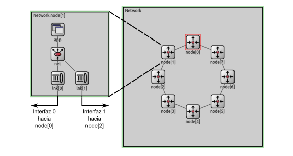

# Informe 
## Resumen

Este informe analiza y compara un algoritmo de enrutamiento diseñado para redes con topología de anillo. 

## Introducción

### Estrategias de enrutamiento

El enrutamiento en redes de computadoras es un problema abordado en la capa de red del modelo OSI o TCP/IP, cuyo objetivo es encontrar la ruta más eficiente para enviar datos desde un punto de origen a un destino. Esto optimiza el rendimiento de la red y reduce la cantidad de paquetes retrasados o perdidos.

Existen diversas estrategias para resolver este problema, cada una con ventajas y desventajas. En este informe se analizará el rendimiento de un algoritmo de enrutamiento específico y se comparará con el algoritmo inicial proporcionado por la cátedra.

## Metodología de trabajo

Para evaluar el comportamiento de la red con y sin el algoritmo, se utilizará simulación discreta, como en el laboratorio 3.

La simulación discreta divide el tiempo en pasos o intervalos discretos, cada uno representando un punto en el tiempo donde se actualiza el estado del sistema simulado. Esta técnica es útil para modelar sistemas dinámicos complejos, simplificando el proceso de cálculo y facilitando el seguimiento de los cambios en el sistema en diferentes momentos.

Las simulaciones se realizan utilizando Omnet++, un entorno de simulación de eventos discretos. En este entorno se crea un modelo que representa una red simplificada y su comportamiento. El objetivo es analizar cómo funciona la red en diferentes escenarios.

Omnet++ permite realizar estas simulaciones y analizar los resultados obtenidos, proporcionando un entorno flexible para modelar distintos aspectos de la red y realizar experimentos virtuales. Esto ayuda a comprender el comportamiento de la red en diferentes situaciones y a evaluar la eficacia de los algoritmos en la optimización del rendimiento de la red.

La simulación discreta permite simular el comportamiento de la red en menos tiempo que realizando pruebas en una red real y permite analizar situaciones difíciles de replicar en una red física. Por ello, es una herramienta útil para el análisis del comportamiento de redes.

## Análisis de los experimentos

Evaluaremos la estrategia de enrutamiento mediante dos casos de prueba:

- **Caso 1:** Se envían paquetes de manera regular desde dos nodos (nodo 0 y nodo 2) hacia un mismo nodo (nodo 5).
- **Caso 2:** Se envían paquetes de manera regular desde todos los nodos (excepto el nodo 5) hacia el nodo 5.

### Estructura de la red

La red utilizada en las simulaciones tiene una topología de anillo. Cada nodo cuenta con una capa de aplicación (app) que genera y consume paquetes, una capa de red (net) que se encarga del enrutamiento, y dos capas de enlace (lnk) que envían los paquetes a los vecinos y almacenan los paquetes en un buffer hasta que puedan ser enviados. Así, cada nodo está conectado a dos vecinos, uno a la izquierda y otro a la derecha. La estructura de la red se puede visualizar en la siguiente imagen:

Cada paquete que recibe la capa de red es evaluado para determinar si el nodo local es su destino final. Si lo es, el paquete se envía a la capa de aplicación local; si no, se elige una interfaz para retransmitirlo.

Para todos los casos de prueba la tasa de transferencia de todos los enlaces es de 1 Mbps, su retardo es de 0,1 ms y el tiempo de simulación es de 200 segundos. A modo de poder estudiar mejor el algoritmo a implementar, la tasa de generación en segundos será una distribución exponencial centrada en 1 y los paquetes tendrán un tamaño de 125000 bytes para analizar el algoritmo proveído por la cátedra; cuando analicemos nuestro algoritmo, la tasa de generación, también en segundos, será una distribución exponencial pero centrada en 0.1 y los paquetes tendrán un tamaño de 12500 bytes. Cuando se refiera al tamaño del buffer de un nodo, se está hablando de la interfaz 0 de dicho nodo salvo que se indique lo contrario.

En todo gráfico que mostramos, se cumple que el eje X se corresponde al tiempo de la simulación y el eje Y con segundos cuando hablemos de demora y con cantidad de paquetes cuando hablemos del tamaño de un buffer.

Se modificó la capa de app del kickstarter para permitir la medición de estadísticas de la red, como paquetes enviados, paquetes recibidos, contador de saltos, demora en la entrega de paquetes, utilización de los buffers, etc. Después de cada simulación, se accede a estas estadísticas para generar los gráficos y tablas presentados en este informe, permitiendo analizar el rendimiento de la red y comparar los distintos casos. Una aclaración respecto a los saltos, es que no se interpreta como un salto más cuando se llega al destino, esto permite que existan saltos de coste 0.

### Algoritmo Base

En la implementación original de la cátedra, la capa de red siempre envía el paquete por la interfaz 0 (toLnk[0]), que dirige el tráfico en sentido horario a lo largo del anillo hasta llegar al destino. No se toman decisiones basadas en la eficiencia o minimización de la ruta, por lo que el rendimiento de la red con esta estrategia esta lejos de ser el óptimo.

#### Caso 1

En este escenario de prueba, se enviaron paquetes de forma constante desde dos nodos (el nodo 0 y el nodo 2) hacia un solo nodo (el nodo 5). Los resultados obtenidos siguiendo, como se mencionó anteriormente, una distribución exponencial con media de 1 segundos fueron los siguientes:

| Paquetes enviados | Paquetes recibidos | Demora promedio | Saltos promedio |
|-------------------|--------------------|-----------------|-----------------|
| 390               | 196                | 51.15           | 3.91            |

##### Demora

La demora promedio de 51.159 segundos es considerablemente alta. Esto sugiere que los paquetes están experimentando retrasos significativos en la red como consecuencia de la ineficiencia del algortimo de enrutamiento ya que es demasiado simple.

##### Paquetes

Como primer punto, observamos que el nodo 5 recibió aproximadamente la mitad de los paquetes enviados desde los nodos 0 y 2. Esto ocurre porque, en la configuración actual, no se selecciona la ruta óptima para enviar los paquetes desde el nodo 2 al nodo 5. Esta situación crea un cuello de botella en el enlace que conecta el nodo 0 con el nodo 1, lo que resulta en la acumulación de paquetes en ese buffer, tal como se muestra en los gráficos. Todos los demás buffers mantienen valores aceptables.

El crecimiento lineal del tamaño del buffer 0 se debe a que, además de estar constantemente recibiendo paquetes provenientes de su capa de aplicación, se encuentra entre el camino que toma el nodo 2 hacia el nodo 5, teniendo que reenviar los nodos de este. Si al trabajo extra le sumamos que los paquetes se generan y procesan aproximadamente en 1 segundo, esto provoca que el buffer 0 reciba alrededor de 2 paquetes por segundo haciendo que la gráfica aumente casi linealmente en 1 cada segundo. Si se eligiera la ruta óptima para el envío de paquetes, la demora sería constante y significativamente menor, ya que los paquetes de los nodos 0 y 2 utilizarían rutas diferentes y no se acumularían en el mismo buffer.

El nodo 2 también experimenta un crecimiento en el tamaño de su buffer en ciertos momentos de la simulación, debido a la aleatoriedad en la generación de paquetes. Sin embargo, fuera de estos picos, el tamaño del buffer es aceptable.

##### Saltos

El número de saltos promedio de 3.91 indica que, en promedio, los paquetes están atravesando casi 4 nodos antes de llegar a su destino. Como sabemos, no se selecciona la ruta óptima para enviar los paquetes, entonces esto sugiere que los algoritmos de enrutamiento están provocando rutas más largas de lo necesario. Esto aumenta el número de saltos y, por ende, la probabilidad de congestión y retrasos. También, la acumulación en los buffers, especialmente en el nodo 0, se debe al uso compartido del enlace para paquetes provenientes tanto del nodo 0 como del nodo 2. Esto no solo incrementa la demora, sino también el número de saltos para llegar a destino.

#### Caso 2

En este escenario de prueba, se enviaron paquetes de forma constante desde todos los nodo hacia el nodo 5. Los resultados obtenidos fueron los siguientes:

| Paquetes enviados | Paquetes recibidos | Demora promedio | Saltos promedio |
|-------------------|--------------------|-----------------|-----------------|
| 1378              | 199                | 64.53           | 2.06            |

##### Demora

Muy similar al análisis del gráfico del caso 1. Si bien los altibajos son más pronunciados, lo importante a analizar es la tendencia a la subida del delay. Esto es generado porque el algoritmo de enrutamiento sólo dirige paquetes en una misma dirección y, además, ahora se suma el agravante de que la carga de la red es aún mayor. Por lo tanto, con todos los nodos enviando paquetes al nodo 5, la carga de la red es considerablemente mayor. Esta alta carga causa congestión y acumulación en los buffers, lo que incrementa la demora promedio.

##### Paquetes

Es el mismo análisis del caso 1 solo que ahora existe mayor acumulación en los buffers porque todos los nodos generan paquetes a diferencia del caso 1. 

Solo destacar dos cosas más: por un lado el buffer 4, es el único que se encuentra menos congestionado ya que se encuentra justo despues del nodo 5 (donde se dirigen todos los paquetes), por lo tanto este buffer solo almacena sus paquetes generados y no sufre congestion por los paquetes de los demás nodos ya que viajan en una sola dirección. Y, por otro lado, se sufre el mismo efecto que sucedía entre los nodos 0 y 2 en el caso anterior. Cada nodo generador (exceptuando el cuarto) recibe constantemente paquetes tanto de su capa de aplicación, como de la capa de aplicación del nodo inmediatamente anterior a ellos en sentido horario.

##### Saltos

Si bien el número es demasiado bajo y podríamos estar interpretando que ha ocurrido una mejora en la ruta que tomaron los paquetes, esto no es así. Lo que sucede en realidad, es que los paquetes que están mas próximos al nodo de destino son los que llegan primero y por eso el valor da más bajo (en promedio) que en el caso 1. Estos nodos cercanos tienen rutas directas y cortas hacia el destino siguiendo el algoritmo de enrutamiento básico, lo que disminuye el promedio de saltos. Pero, si observamos el tiempo de retardo promedio, nos da demasiado alto (más de 10 segundos respecto al caso 1) y esto sugiere que existe una mayor acumulación de paquetes en los buffers a pesar de que se mejoró en promedio el número de saltos. 

### Algoritmo Implementado

Del análisis anterior podemos notar que la implementación base tiene dos problemas principales: 

+ **Altas demoras**
+ **Tamaños de buffers muy variables**

La idea será crear un algortimo de enrutamiento que priorice disminuir la demora de la red y que sea capaz de adaptarse dinámicamente a las circunstancias. Se espera que este enfoque distribuya más equitativamente los tamaños que alcanzan los bufferes.
El algoritmo consta de los siguientes pasos:

1. **Envio paquete POLL**

   En un principio, cada nodo envía un paquete POLL por todas sus interfaces para poder obtener información sobre la red. Con el fin de modelar un sistema más real y como estos paquetes están pensandos para guardar bastantes datos los cuales incrementan dependiendo del tamaño de la red, estos tienen el considerable tamaño de 512 bytes. Tengo la garantía, como estoy en una topología de anillo, que si cada enrutador reenvía un paquete POLL foráneo siempre por la misma interfaz (izquierda o derecha), este eventualmente recorrerá todos los nodos una vez antes de llegar de nuevo al emisor. Los campos del paquete son:

   + _source:_ Entero sin signo de 4 bytes que representa la dirección del enrutador que genera el paquete. En lo que respecta a los paquetes POLL, sirve también como destino.
   + _hopCount:_ Entero sin signo de 4 bytes para medir la cantidad de saltos. Se incrementa cada vez que el paquete es recibido hasta que llega al origen.
   + _information[N]:_ Arreglo donde se guarda la información obtenida de los nodos de la red. Cada entrada contiene un entero sin signo de 4 bytes que representa la dirección del enrutador al cual pertenece la información, otro para guardar el costo expresado en saltos y un flotante de doble precisión para almacenar el tiempo en el que se recibió el paquete.
   + _side:_ Valor booleano para determinar si el POLL que recibo viajó en sentido horario o antihorario. Si me llegó por izquierda es True y si me llegó por derecha es False.
  
2. **Cálculo de las tablas de enrutamiento**
   
   Una vez reciba todos mis paquetes POLL, ya puedo computar mis tablas de enrutamiento. Para determinar porque interfaz reenviar un paquete, la idea será comparar los valores obtenidos de los paquetes y quedarme con la salida por donde fue enviado el paquete POLL que consiguió la menor demora. En caso de iguales, se compara respecto a la cantidad de saltos quedándonos con la interfaz que menos necesite. Si resulta que este valor es idéntico para ambos, se elige una interfaz por defecto.

3. **Progamar Actualización**

   Como queremos un algortimo que se adapte al estado de la red, necesitamos volver a calcular las demoras en un tiempo dado que reflejen la situación de los buffers. Para ello, repetimos el algoritmo cada S segundos donde S se calcula como _S = #Interfaces * (POLL-SizeInBytes / 100Bytes)_.

#### Caso 1

En este escenario de prueba, nuevamente se enviaron paquetes de forma constante desde los nodos 0 y 2 hacia el nodo 5. Los resultados obtenidos con una distribución exponencial con media de 0.1 segundos, como se avisó anteriormente, fueron los siguientes:

| Paquetes enviados | Paquetes POLL | Paquetes procesados | Demora promedio | Saltos promedio |
|-------------------|---------------|---------------------|-----------------|-----------------|
| 3918              |96             | 3253                | 25.22           | 3.91            |

##### Demora

Respecto al algoritmo original, podemos ver como nuestra meta principal de reducir la demora se cumple satisfactoriamente reduciendo en más del 50% la demora promedio.

Estas "tiras verdes de papel crepe ubicadas diagonalmente", por así decirlo, se corresponden al período entre tandas de paquetes POLLs enviados por los nodos. Cada nodo envió un total de 12 paquetes (6 por cada interfaz) ya que el total de paquetes POLL generados fue de 96 y todos los nodos produjeron paquetes a lo largo de la simulación. Aunque _S_ en este caso es de 10.24 segundos, notar que el algoritmo se ejecutó solo 6 veces por nodo durante los 200 segundos de la simulación debido a que se espera a que todos los paquetes POLL estén de regreso antes de recalcular las tablas. Esto es lo que sucede más a detalle: 

El primer intervalo se puede observar desde el segundo 0 hasta el segundo 11 aproximadamente. Considerando que cada paquete realiza 8 saltos y teniendo en cuenta su tamaño y el ancho de banda más la demora, llegamos a que, en un inicio cuando los bufferes están vacíos, cada paquete es procesado en menos de 35 milisegundos y también en ese tiempo son creadas las tablas de enrutamiento. Como se puede ver desde la gráfica, la demora es cercana a 0 durante este periodo mostrando así que nuestro algortimo toma muy buenas rutas cuando la red no está congestionada.

Los siguientes 3 intervalos se dan aproximadamente entre los segundos 11-33, 33-78 y 78-121. Su comienzo se corresponde al extremo izquierdo de la tira de papel crepe y tanto el tamaño de los cortes o huecos que presenta, como los puntos anómalos en ellas, se deben al intervalo variable de generación de los paquetes desde la capa de aplicación. Cada tira tiende a aumentar gracias a la congestión que se presenta cuando se llenan los bufferes sin embargo, al momento en el que los paquetes POLL están de vuelta, y por tanto se actualizan las tablas, vemos como inmediatamente el nuevo enrutamiento baja la curva de demora. En la práctica, ya que estamos en una topología de red anillo esto representa un cambio de dirección para los paquetes más alejados del destino. Por su parte, los paquetes más cercanos al nodo 5, dificilmente cambiarán su ruta lo que provoca grandes acumulaciones de paquetes en los bufferes de capa de enlace más lindantes al nodo de destino. Esto se representa en el gráfico como el seguimiento de la tira de papel crepe del intervalo anterior una vez que comienza el nuevo intervalo. Dicho fenómeno es el que provoca que el final de una tira de papel crepe no se corresponda con el final del intervalo que la ocasionó. Cabe mencionar que el período de tiempo entre la creación de tiras sera cada vez más largo debido a la preciencia de congestión.

Por último, el quinto inervalo comienza con la llegada de la quinta tanda de paquetes POLL en el segundo 121 aproximadamente.Pero a pesar de que sí se envió una sexta tanda de paquetes, en el momento en el que finalizó la simulación estos todavía rondaban por la red lo que hace que no podamos determinar cuando finaliza el quinto intervalo. Fuera de eso, el comportamiento de esta última tira apreciable es el mismo que el de las anteriores.

##### Paquetes

La siguiente tabla muestra para cado nodo cuantos paquetes recibieron los buffers de capa de enlace durante la simulación. 

|Nodo             |Lnk[0]           |Lnk[1]           |
|-----------------|-----------------|-----------------|
|0                |2587             |1892             |
|1                |1811             |1212             |
|2                |1212             |1842             |
|3                |1814             |1813             |
|4                |1812             |1811             |
|5                |1810             |1626             |
|6                |1627             |1626             |
|7                |1628             |2031             |

Como dato más destacable, vemos que se procesaron más de un 75% de todos los paquetes generados lo cual es más de un 50% de mejora comparado con el algortimo base. Además, de la tabla podemos notar que nuestro algortimo distribuye homogeneamente el tamaño de los bufferes. Las diferencias más grandes se dan en los nodos emisores. La mayor parte del tiempo, el nodo 2 optó por mandar sus paquetes en sentido antihorario mientras que el nodo 0 prefirió hacerlo en sentido horario. Esto tiene sentido puesto que esos caminos generan menores saltos para cada nodo y por lo tanto menos demoras en caso promedio.

##### Saltos

A pesar de que en un momento dado se decidió por tomar caminos que involucraran más saltos a cambio de una menor demora, este _tradeoff_ no empeoró la cantidad de saltos promedios respecto a cuando se utilizaba el algoritmo base. Esto es porque el algoritmo original, si bien siempre usaba el camino de menos saltos para el nodo 0, usaba el camino de más saltos para el nodo 2; mientras que, por su parte, si bien el algoritmo implementado por nosostros prioriza reducir la demora, consigue en promedio equilibrar la cantidad de saltos de los caminos y no llegar a utilizar rutas más largas la mayor parte del tiempo.

#### Caso 2

En este escenario de prueba, se enviaron paquetes de forma constante desde todos los nodo hacia el nodo 5. Los resultados obtenidos fueron los siguientes:

| Paquetes enviados | Paquetes POLL | Paquetes procesados | Demora promedio | Saltos promedio |
|-------------------|---------------|---------------------|-----------------|-----------------|
| 140002            | 48            | 3997                | 63.43           | 1.83            |

##### Demora

A diferencia de lo que creíamos, para este caso nuestro algoritmo no fue capaz de mejorar notablemente la demora. Siguiendo el razonamiento del caso anterior, cada nodo envió 3 paquetes POLL por interfaz los cuales no fueron capaces de reducir la curva de demora. Cabe agregar que la demora también se debe a la presencia de loops: uno entre los nodos 0 y 1 y otro entre los nodos 1 y 2. Esto sucede porque las actualizaciones de las tablas de todos los nodos no están sincronizadas y pueden darse en distintos momentos a lo largo de la simulación. Las tablas de enrutamiento de los nodos 0 y 2 se actualizaron antes que las del nodo 1; mientras que este último estaba mandando paquetes por alguna de sus interfaces, los otros nodos ya se habían actualizado y estaban mandando paquetes en el sentido opuesto al que lo hacía 1, entonces, cuando el nodo 1 enviaba un paquete, este le era devuelto después de los retardos y así sucesivamente hasta que llegaban los POLLs del nodo 1.

En esta gráfica, es dificl observar los intervalos que se podían ver en el caso uno. Visualmente, son dos tiras de papel crepe solapadas de las cuales no se puede identificar un inicio y un final.

##### Paquetes

La siguiente tabla muestra para cado nodo cuantos paquetes recibieron los buffers de capa de enlace durante la simulación. 

|Nodo             |Lnk[0]           |Lnk[1]           |
|-----------------|-----------------|-----------------|
|0                |1555             |2259             |
|1                |2138             |2347             |
|2                |1203             |3259             |
|3                |2038             |4109             |
|4                |2033             |4007             |
|5                |2033             |2034             |
|6                |3999             |2034             |
|7                |3554             |1555             |

Los datos arrojan una distribución con diferencias más pronunciadas entre los bufferes de un nodo respecto al caso anterior. Esto es debido a que ahora la menor demora se conseguía en los caminos de menos saltos debido a que las colas estaban muy llenas. La opción de la ruta más óptima fue muy fácil de tomar para los nodos cercanos al nodo de destino. Solamente el nodo 1 que es el que está a la misma distancia en lo que a saltos respecta del nodo 5 por ambos caminos, es el que tuvo un tamaño de bufferes masomenos parejo en su capa de enlace. Esto se debe a que en un principio optó por defecto mandar por la interfaz 0, generando una mayor carga por la parte derecha del anillo; cuando su segunda tanda de paquetes POLLs le llegó y actualizó su tabla, se dió cuenta que le convenía mandar por el sentido antihorario donde no se encontraba sla carga extra que el mismo generó. Debido a la congestión, la segunda camada de paquetes POLL llegó a su origen aproximadamente a mitad de la simulación y todo esto fue lo que hizo que el nodo 1 repartiera sus paquetes equitativamente.

La única mejora, es que estuvimos muy cerca de alcanzar el máximo número de paquetes procesados por la capa de aplicación. Pero esto no es muy sorprendente, ya que los vecinos del nodo destino están constantemente mandando paquetes, es decir, también hubiéramos estado cerca de alcanzar el máximo teórico si solamente los nodos 4 y 6 le mandaran paquetes a 5.

##### Saltos

Debido a la alta cantidad de paquetes en los bufferes para este caso, si bien el algoritmo buscaba alcanzar la demora óptima, aquí esto equivalía a utilizar los caminos más cortos que fue lo que terminó haciendo el algoritmo. Por lo tanto, observamos una ligera mejora en la cantidad de saltos respecto a cuando no estaba el algoritmo pero, como mencionamos en el análisis sin el algoritmo, esto tampoco es muy dificil de lograr debido a la naturaleza del caso en si.

## Conclusión

Como principal punto, una buena propiedad del algoritmo es que nunca empeoró alguna de las medidas tomadas con el algortimo de la cátedra. 

En cuanto mejoras, logramos procesar muchos más paquetes que antes, disminuir un poco la demora y reducir en menor medida los saltos presentes en los caminos.

Lo que agrega el algoritmo es una pequeña carga en la red de paquetes POLL, la necesidad de espacio en memoria de los routers para que estos puedan guardar las tablas de enrutamiento y el código de los algortimos que las actualizan, y la presencia de loops de enrutamiento a altos niveles de congestión, como se explicó en el análisis caso 2.

Por último, como mejoras al algoritmo podríamos hacerlo más general y que no sea dependiente de una topología de anillo, y también agregarle algún tipo de temporalizador a los paquetes POLL para establecerles un tiempo de vida y así quitar la necesidad de esperar a que lleguen todos para actualizar la tabla cuando hayan algunos que estén demorando demasiado. Esto tiene sentido ya que los paquetes POLL que llegaron antes fueron los que pasaron por las rutas más rápidas y, por lo tanto, son los que tienen los resultados que más me sirven para actualizar las tablas; es más conveniente tener una tabla parcialmente actualizada con la información más relevante y que se actualice rápido, a tener una tabla completamente actualizada pero que demore mucho en hacerlo y por consecuente tenga información antigüa.  