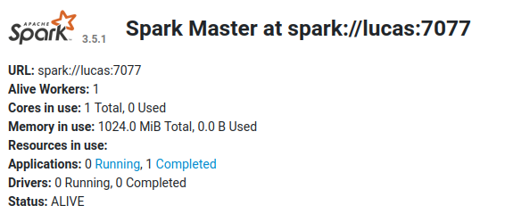

# Preparación del entorno
1. Instalar [maven](https://maven.apache.org/guides/getting-started/maven-in-five-minutes.html) Es probable que sea un paquete de tu distribución (`$ sudo apt install maven` si estás en Ubuntu, Debian o derivados).

2. Descargar [spark 3.5.1](https://www.apache.org/dyn/closer.lua/spark/spark-3.5.1/spark-3.5.1-bin-hadoop3.tgz)

3. En la carpeta donde fue descomprimido Spark, crear la variable de entorno ```$SPARK_HOME```. Para ello ejecutar:
```bash
    $ export SPARK_HOME=$(pwd)
```

4. Luego, dirigirse al directorio donde se clonó el repositorio, y establecer la variable de entorno ```$APP_HOME```:
```bash
    $ export APP_HOME=$(pwd)
```

# Cómo compilarlo:
1. Ejecutar:
```bash
    $ cd namedentitiescount
    $ mvn install
```

# Cómo correrlo

## Para correr localmente:

1. Ejecutar:
```bash
    $ sbin/run-local.sh [SPARK_OPTIONS] -- [APP_OPTIONS]
```

## Para montar un clúster de Spark:

>*Antes de inciar un nuevo worker o master se recomienda hacer:*
> ```bash
>    $ sbin/stop-all.sh
> ```

1. Crear un nodo master:
```bash
    $ $SPARK_HOME/sbin/start-master.sh
```

Si la operación fue exitosa en [http://localhost:8080](http://localhost:8080/) podremos observar algo cómo lo siguiente:



2. Copiar la ```URL ``` y ejecutar:
```bash
    $ sbin/run-by-cluster.sh <URL> [SPARK_OPTIONS] -- [APP_OPTIONS]
```

> *Para correr el programa nuevamente, simplemente vuelva a ejecutar el comando anterior.*

---

# Cómo correr manualmente:

Si logró crear el entorno correctamente y también compilar pero hubo algún error con la ejecución, puede probar correr el proyecto manualmente siguiendo estos pasos:

## Para correr localmente:

1. Ejecutar:
```bash
    $ $SPARK_HOME/bin/spark-submit [SPARK_OPTIONS] --master local[n] $APP_HOME/namedentitiescount/target/NamedEntitiesCount-1.0-SNAPSHOT.jar [APP_OPTIONS]
```

> *Agregar `2>/dev/null` al final si se desea omitir la información de Spark.*

## Para montar un clúster de Spark:

1. Copiar el archivo de configuración:
```bash
    $ cp $SPARK_HOME/conf/spark-env.sh.template $SPARK_HOME/conf/spark-env.sh
```
2. Agregar a $SPARK_HOME/conf/spark-env.sh lo siguiente:
```bash
    $ SPARK_WORKER_INSTANCES=2
```

>*Antes de inciar un nuevo worker o master se recomienda hacer:*
> ```bash
>    $ $SPARK_HOME/sbin/stop-master.sh
>    $ $SPARK_HOME/sbin/stop-worker.sh
> ```

3. Ejecutar:
```bash
    $ $SPARK_HOME/sbin/start-master.sh
```

Se debería poder visualizar el clúster usando la URL: [http://localhost:8080](http://localhost:8080/).

4. Copiamos la URL de la página.


5. Ejecutamos el siguiente comando:
```bash
    $ $SPARK_HOME/sbin/start-worker.sh <URL> 
```
6. Corremos el proyecto:
```bash
    $ $SPARK_HOME/bin/spark-submit [SPARK_OPTIONS] --master <URL> $APP_HOME/namedentitiescount/target/NamedEntitiesCount-1.0-SNAPSHOT.jar [APP_OPTIONS]
```

> *Agregar `2>/dev/null` al final si se desea omitir la información de Spark.*

## Videos

**[Video](https://drive.google.com/file/d/1ld9aRmx-66zOiqzwQ3tmlwYOpWKRT_-R/view?usp=drive_link)** *de cómo compilar y ejecutar el laboratorio manualmente en modo 'local'*.

**[Video](https://drive.google.com/file/d/1pCxPEliXHkf18CXLbGmBOiXCA7HC9EJa/view?usp=drive_link)** *de cómo compilar y ejecutar el laboratorio manualmente en modo 'clúster'*.

---

> *Para dudas acerca de la aplicación, consulte el [laboratorio 2](https://bitbucket.org/paradigmas-2024-famaf/paradigmas24lab2g36/src/main/).*

> *En caso de modificar el código, reconstruir el proyecto desde la carpeta ```namedentitiescount``` con:*
> ```bash
>   $ mvn clean package
>   $ mvn install
> ```