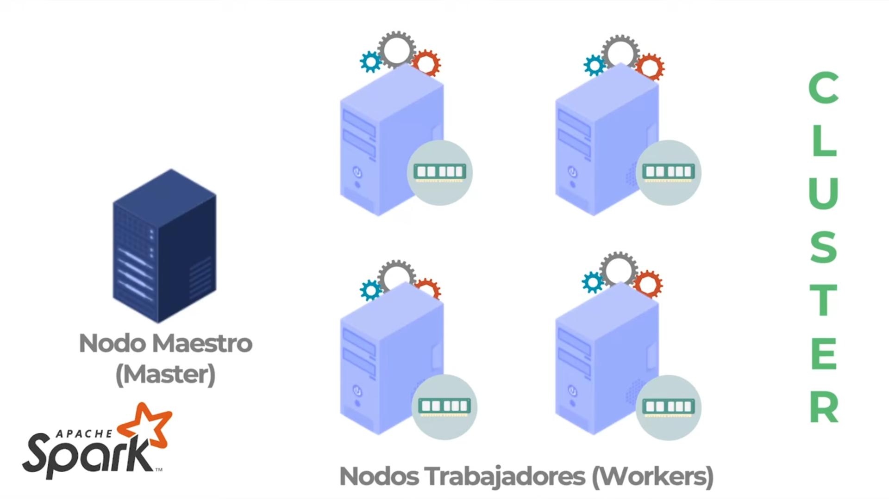
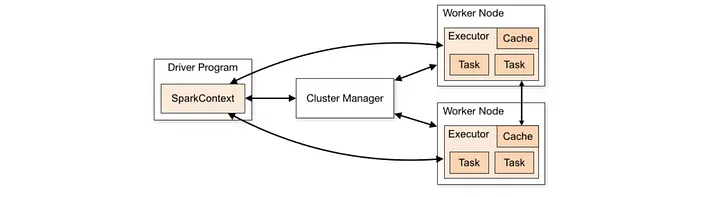
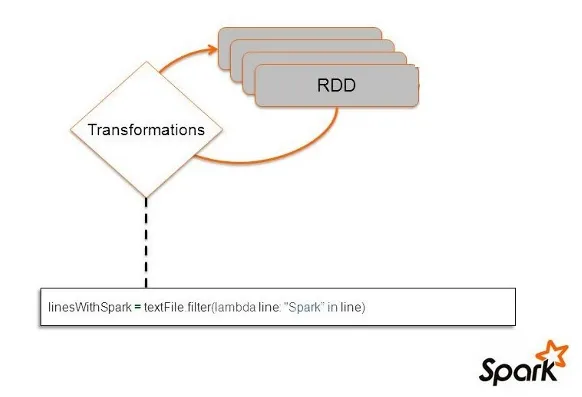
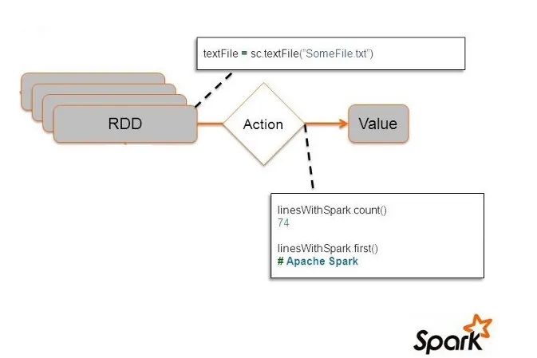
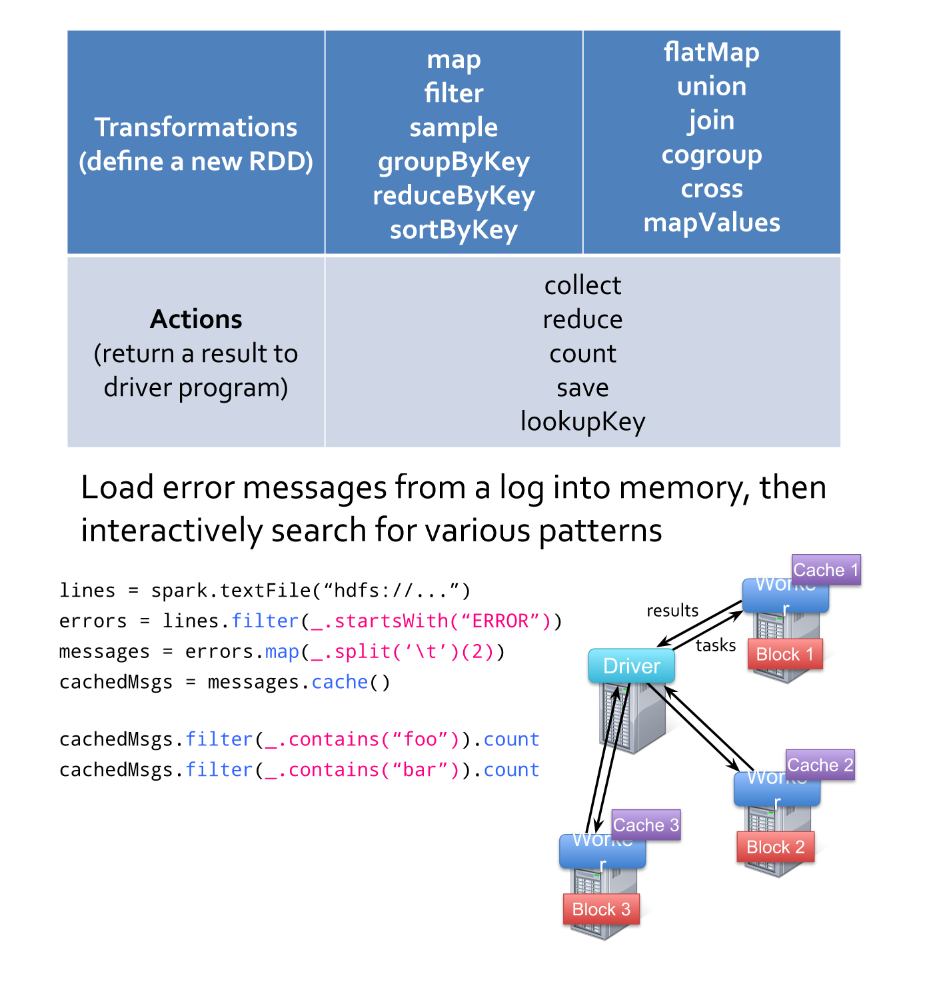

# Laboratorio 3 de Paradigmas de la Programación

## Introducción:

En este laboratorio, trabajaremos utilizando el framework[^1] [Apache Spark](https://spark.apache.org/), que proveé una API en Java. Lo utilizaremos para poder encontrar y computar las estadísticas de las entidades nombradas, desde los feeds del laboratorio anterior, de una manera más eficiente, pues buscaremos paralelilizar[^2] dicha tarea.

> *[Enunciado del lab](https://docs.google.com/document/d/1N6V8fjBbDrCGEHfxVkHVa5kZuO8i9pnSlU5cM3VUAQM/edit#heading=h.xe9t6iq9fo58).* 

---
### Apache Spark:

Es un framework de computación (*entorno de trabajo*) open-source, su motor puede ejecutarse en maquinas individuales o en clústers, es decir, conjuntos de computadoras en las que se divide una tarea. Para ello, Apache Spark, proporciona una interfaz para la programación de clusters completos con paralelismo de datos implícito y tolerancia a fallos, para Java, Scala, Pyhton y R. También proveé un motor optimizado que soporta la ejecución de gráficos y herramientas de alto nivel, cómo [MLib](https://spark.apache.org/mllib/) para implementar maching learning o [GraphX](https://spark.apache.org/docs/latest/graphx-programming-guide.html) para el procesamiento de grafos.

Este framework trabaja con una arquitectura [Master-Slaves](https://en.wikipedia.org/wiki/Master%E2%80%93slave_(technology)): cada computadora en el clúster es un nodo trabajador (*Worker/Slave*) y por cada clúster se tiene un nodo maestro (*Master/Driver*). Las tareas se ejecutan en los workers de forma paralela utilizando el paradigma MapReduce[^3] (*estrategía divide y venceras*). En resumen, el funcionamiento de esta arquitectura es el siguiente: el usuario envía una petición de computo al master y este se encarga de dividir el big data entre los slaves, idealmente de manera uniforme, y estos últimos computan sobre su partición asignada. Finalmente, cuando todos los slaves finalizan, el master recolecta cada una de las soluciones parciales y devuelve al usuario la solución completa. Es importante mencionar que, cómo usuario final, el manejo de datos se da a un alto nivel, por lo que no se tiene conocimiento de cómo estos se distribuyen ni de que hace cada nodo.



> *En este laboratorio lanzaremos 2 workers, para procesar los feeds.*

Dentro de un clúster se tiene un Driver Program y Spark Context que residen en el nodo maestro y los ejecutores que residen en los nodos esclavos.

- **Program Driver:** es un proceso [JVM](https://es.wikipedia.org/wiki/M%C3%A1quina_virtual_Java) responsable de la ejecución de las tareas. Por analogía, en Java la clase que contiene ```public static void main (String args [])``` es el driver o controlador. En el program driver de Spark reside en el nodo maestro y es quien crea y posee el contexto de Spark.

- **Executors:** es la parte de la RAM en el nodo esclavo (nodo worker) donde reside el bloque de datos y la tarea o el código que se implementará. Cada aplicación de Spark tiene su propio proceso de ejecución.

- **Cluster Manager:** es el responsable de asignar recursos a través de la aplicación de Spark. El contexto de Spark es capaz de conectarse a varios tipos de administradores de clúster como [Mesos](https://es.wikipedia.org/wiki/Apache_Mesos), [Yarn](https://spark.apache.org/docs/latest/running-on-yarn.html) o Kubernetes, aparte del administrador de clúster independiente de Spark.



Cada aplicación tiene sus propios procesos ejecutores, que permanecen activos durante toda la aplicación y ejecutan tareas en varios subprocesos. Esto tiene la ventaja de aislar las aplicacione entre sí, tanto en el lado de la planificación (cada driver planifica sus propias tareas) como en el lado del ejecutor (las tareas de diferentes aplicaciones se ejecutan en diferentes JVM). Sin embargo, esto también significa que los datos no se pueden compartir entre diferentes aplicaciones Spark (instancias de Spark Context) sin escribirlos en un sistema de almacenamiento externo.

### ¿Por qué usamos Apache Spark ?

¿Por qué usamos Apache Spark y no locks o interfaces de Java para parelelizar el cómputo? Básicamente, por que el framework nos provee una interfaz que nos abstrae de problemas inherentes a la computación concurrente, cómo las condiciones de carrera[^4] o la sincronización de los procesadores, al mismo tiempo que nos garantiza un uso eficiente de los recursos del sistema, con optimizaciones internas cómo [DAG Scheduler](https://spark.apache.org/docs/1.2.1/api/java/org/apache/spark/scheduler/DAGScheduler.html) (Directed Acyclic Graph). Además, Spark posee una tolerancia a fallos incorporada mediante la replicación de datos y la reejecución de tareas fallidas, lo cual nos ahorra la tarea de tratar errores manualmente.

### ¿Cómo podemos usar Apache Spark?

Una de las abstracciones que proporciona Spark es un conjunto de datos distribuido resiliente ([RDD](https://spark.apache.org/docs/latest/rdd-programming-guide.html)), que es una colección de elementos divididos en los nodos del clúster que se pueden operar en paralelo. Los RDD se crean comenzando con un archivo en el sistema de archivos [Hadoop](https://hadoop.apache.org/) (o cualquier otro sistema de archivos compatible con Hadoop), o una colección Scala existente en el programa controlador, y aplicando una transformación a un RDD ya existente para crear uno nuevo a partir de este. Los usuarios también pueden pedirle a Spark que persista un RDD en la memoria, lo que permite reutilizarlo de manera eficiente en operaciones paralelas.

> *Ejemplo de creación de RDD usando:*
>
> - **Colección de datos:**
> ```Java
>   List<Integer> data = Arrays.asList(1, 2, 3, 4, 5);
>   JavaRDD<Integer> distData = sc.parallelize(data);
> ```
> - **Archivos de texto:**
> ```Java
>   JavaRDD<String> distFile = sc.textFile("data.txt");
> ```

Un RDD no solo se encarga de brindar acceso a datos si no también, pone a disposición del desarrollador una amplia variedad de funciones que nos permiten manipular la información que contiene, para ello Spark proporciona dos conjuntos de funciones que son categorizadas en: acciones y transformaciones.

#### Transformaciones:

Las transformaciones se encargan de manipular el dato, se realizan usando la técnica lazy evaluation[^5]. Así pues, estas son retrasadas hasta que un resultado sea necesario. Cuando Spark detecta que se va a ejecutar una acción, crea un DAG donde va registrando todas las transformaciones de forma ordenada. De este modo, en el momento que se precise, se realizarán las transformaciones, se optimizarán y se obtendrá el resultado esperado.
Una forma de aplicar estas transformaciones, la cual fue usada en este laboratorio, es por medio de las expresiones lambda[^6]. Spark necesita que los elementos a los que se van a aplicar las transformaciones sean serializables para enviarlos a los distinos nodos. Cada función lambda se ejecuta independientemente por cada worker sobre la partición del RDD dada.



>*Los RDD son inmutables por lo que las transformaciones no se aplican al RDD de origen, sino que se crea un nuevo RDD para almacenar dichos cambios.*

#### Acciones: 

Son operaciones que devuelven un valor al controlador del programa Spark o escriben datos a un sistema de almacenamiento externo. Las acciones son responsables de desencadenar la ejecución de la computación que se ha especificado mediante las transformaciones.



#### Ejemplo de uso de transformaciones y errores:



> *Este ejemplo busca el string 'ERROR' en logs.*

---

## Estrcuturadel Proyecto:

```
paradigamas24lab3g36/
└── namedentitiescount
    ├── INFORME.md                                             # Este informe
    ├── pom.xml                                                # Archivo XML con las dependencias
    ├── sbin                                                   # Scripts para correr el proyecto
    │   ├── run-by-cluster.sh
    │   ├── run-local.sh
    │   └── stop-all.sh
    ├── data
    │   ├── bigData.txt                                        # Descripción y título de cada artículo
    │   ├── dictionary.json                                    # Diccionario de entidades nombradas
    │   ├── feeds.json                                         # Datos de feeds de noticias
    │   ├── filterDictionary.json                              # Palabras que NO consideramos entidades nombradas
    │   └── heuristics.json                                    # Breve descripción de las heurísticas disponibles
    ├── imagenes                                               # Imágenes utilizadas en el informe
    ├── sbin                                                   # Scripts propios del proyecto
    ├── src                                                    # Código fuente
    │   ├── main
    │   │   └── java
    │   │       └── app
    │   │           ├── NamedEntitiesCount.java                # Clase principal
    │   │           ├── feed                                   # Feeds y su parseo desde XML
    │   │           │   ├── Article.java
    │   │           │   ├── FeedParser.java
    │   │           │   └── FeedsData.java
    │   │           ├── namedEntities                          # Entidades nombradas y heurísticas
    │   │           │   ├── NamedEntity.java
    │   │           │   ├── categories
    │   │           │   │   ├── Category.java
    │   │           │   │   ├── LOCATION.java
    │   │           │   │   ├── ORGANIZATION.java
    │   │           │   │   ├── OTHER.java
    │   │           │   │   └── PERSON.java
    │   │           │   └── heuristics
    │   │           │       ├── CapitalizedWordHeuristic.java 
    │   │           │       ├── FiltredCapHeuristic.java
    │   │           │       ├── Heuristic.java
    │   │           │       └── NoPrefixDotCapHeuristic.java
    │   │           └── utils                                  # Utilidades para UI y archivos JSON
    │   │               ├── Config.java
    │   │               ├── DirectoryPaths.java
    │   │               ├── JSONParser.java
    │   │               ├── Option.java
    │   │               ├── Stadistic.java
    │   │               └── UserInterface.java
    │   └── test                                              
    │       └── java
    │           └── app
    │               └── AppTest.java                           # Tests autogenerados por Maven
    └── README.md                                              # Cómo compilar y ejecutar el proyecto
```

---

## Modificaciones respecto al laboratorio 2:

### Modularización

Varias partes del código fueron modularizadas, en función de las observaciones que nuestro profesor nos comentó, como ser: 

- En el archivo [NamedEntitiesCount.java](/namedentitiescount/src/main/java/app/NamedEntitiesCount.java) redujimos el tamaño del método main repartiendo métodos y variables entre los archivos [UserInterface.java](/namedentitiescount/src/main/java/app/utils/UserInterface.java), [Heuristics.java](/namedentitiescount/src/main/java/app/namedEntities/heuristics/Heuristic.java), [Article.java](/namedentitiescount/src/main/java/app/feed/Article.java) y [FeedsData.java](/namedentitiescount/src/main/java/app/feed/FeedsData.java)

- En las clases derivadas de Heuristics.java por medio del método de ```normalize``` evitamos la repetición innecesaria de código la mayoría de las heurísticas.

### Ejecución

Pasamos de correr el proyecto con Makefile a correrlo con Maven. Esto trajo consigo:  

- La comprensión de las funcionalidades básicas de Maven para crear y compilar proyectos.

- La necesidad del archivo [pom.xml](pom.xml) para gestionar las dependencias.

- La creación de archivos .sh para facilitar las ejecución del proyecto.

- La utilización de variables de entorno para otorgarle más portabilidad a la aplicación.

> *Se siguió la idea del [esquelto](https://bitbucket.org/paradigmas-programacion-famaf/spark-skeleton/src/main/) provisto por la cátedra.*

### Construcción de bigData.txt

Para ello, declaramos un método ```storeBigData``` en la clase UserInterface dónde creamos un archivo ```bigData.txt``` que se guarda en la carpeta [data](data) para así escribir en este los títulos + las descripciones de los artículos de cada feed parseado desde [feeds.json](data/feeds.json).

```java
    private static void storeBigData(List<List<Article>> allArticles) {
        String content = "";

        for (List<Article> articles : allArticles) {
            content = content + Article.ArticlestoText(articles) + "\n";
        }

        DirectoryPaths p = new DirectoryPaths();
        File file = new File(p.getDataPath() + "/bigData.txt");

        try {
            FileWriter writer = new FileWriter(file);
            writer.write(content);
            writer.close();
        } catch (IOException e) {
            System.err.println("Error al escribir en el archivo: " + e.getMessage());
        }
    }
```

El manejo de las rutas de los directorios trajo consigo la creación de una nueva clase [DirectoryPaths](/namedentitiescount/src/main/java/app/utils/DirectoryPaths.java). En ella, la dirección a la carpeta de la data se obtiene como sigue:

```java
    package app.utils;

    public final class DirectoryPaths {
    
        private String dataPath;

        public DirectoryPaths() throws IllegalArgumentException {
            dataPath = System.getenv("APP_HOME");
            if (dataPath != null) {
                dataPath += "/namedentitiescount/data";
            }
            else {
                throw new IllegalArgumentException("APP_HOME environment variable is not set appropriately.");
            }
        }

        public String getDataPath() {
            return dataPath;
        }
}


``` 

También hubieron cambios menores en la función getCandidates() de la clase UserInterface para poder trabajar con un archivo de texto:

```java
private static List<String> getCandidates(Config config, JavaSparkContext sc) {
                                        ⁝
        storeBigData(articles);

        // Leer el contenido del archivo como un String
        String text = "";
        DirectoryPaths p = new DirectoryPaths();
        try {
            text = new String(Files.readAllBytes(Paths.get(p.getDataPath() + "/bigData.txt")));
        } catch (IOException e) {
            System.err.println("Error al leer el archivo: " + e.getMessage());
        }
```

### Uso de la API de Spark

#### Paralelización en la extracción de candidatos

Se módifico la implementación del metódo abstracto ```Extraction``` de las derivadas de la clase Heuristic para soportar paralelización. 

- **CapitalizedWordHeuristic:** Ahora se instancia un RDD llamando al metódo ```parallelize``` para contener la big data, la cual se distribuye por líneas entre los workers que independientemente se encargan de procesar el string según corresponda. Para ello crean internamente otro RDD mediante la transformación ```flatMap``` y finalmente se aplica la acción ```collect``` para recolectar todas las palabras matcheadas en una lista de strings.

> *Aquí cada línea es un string formado por los títulos y las descripciones de todos los artículos de un feed.*

```java
    public List<String> Extraction(String text, JavaSparkContext sc) {
        text = Normalize(text);

        List<String> lines = Arrays.asList(text.split("\n"));
        JavaRDD<String> linesRDD = sc.parallelize(lines);

        JavaRDD<String> candidatesRDD = linesRDD.flatMap((FlatMapFunction<String, String>) line -> {
            List<String> candidates = new ArrayList<>();
            Matcher matcher = pattern.matcher(line);

            while (matcher.find()) {
                candidates.add(matcher.group());
            }
            return candidates.iterator();
        });

        List<String> candidates = candidatesRDD.collect();
        return candidates;
    }
```

> *Ahora el objeto ```pattern``` es un campo privado estático y final de la heurística.*
> ```java
>   public final class CapitalizedWordHeuristic extends Heuristic {
>   private static final Pattern pattern = Pattern.compile("[A-Z][a-z]+(?:\\s[A-Z][a-z]+)*");
> ```

- **NoPrefixDotCapHeuristic:** El uso de la API en esta heurística es bastante similar al de la anterior ya que son bastante parecidas.

```java
    public List<String> Extraction(String text, JavaSparkContext sc) {
        text = text.replaceAll("[-+^:;,\"]", "");
        text = Normalizer.normalize(text, Normalizer.Form.NFD);
        text = text.replaceAll("\\p{M}", "");

        List<String> lines = Arrays.asList(text.split("\n"));
        JavaRDD<String> linesRDD = sc.parallelize(lines);

        JavaRDD<String> candidatesRDD = linesRDD.flatMap((FlatMapFunction<String, String>) line -> {
            List<String> candidates = new ArrayList<>();
            Matcher matcher = pattern.matcher(line);

            while (matcher.find()) {
                candidates.add(matcher.group());
            }
            return candidates.iterator();
        });

        List<String> candidates = candidatesRDD.collect();
        return candidates;
    }
```

- **FiltredCapHeuristic:** Para está heurística, continuamos con la misma idea pero cambiamos un poco la lógica del método. En lugar de obtener cada candidato y eliminarlo si pertenece a la lista de palabras a filtrar en un mismo bucle while, aprovechamos las transformaciones de Spark y separamos este proceso en dos subprocesos: Primero, obtener los candidatos de manera distribuida (al igual que en la primera heurística); y luego quitamos las repeticiones utilizando la transformación ```filter``` de Spark como se muestra a continuación: 

```java
    candidatesRDD = candidatesRDD.filter(word -> !filterWords.contains(word));
```

#### Paralelización en la clasificación de candidatos

Se modificó el método ```Classification``` de la clase abstracta Heuristic para soportar paralelización. Ahora, en lugar de agregar entidades nombradas al mismo tiempo que se descartan las repetidas, dividimos esta tarea en dos subtareas: 

1. Agregar todas las entidades nombradas halladas a una RDD de pares (*String*, *NamedEntity*)

```java
    JavaRDD<String> candidatesRDD = sc.parallelize(Candidates);
        
    JavaPairRDD<String, NamedEntity> entityPairsRDD = candidatesRDD.mapToPair(candidate -> {
        for (NamedEntity dictEntity : DictionaryEntitites) {
            List<String> Keywords = dictEntity.getKeywords();
            for (String key : Keywords) {
                if (key.equals(candidate)) {
                    return new Tuple2<>(dictEntity.getName(), dictEntity);
                }
            }    
        }
        // Si el candidato no aparece en el diccionario, se guarda como OTHER
        Category DefaultCategory = new OTHER();
        List<String> DefaultTopic = new ArrayList<>();
        DefaultTopic.add("OTHER");
        return new Tuple2<>(candidate, (new NamedEntity(candidate, DefaultCategory, DefaultTopic, null)));
    });
```

2. Reducir las repetidas a una única entidad que registre el total de apariciones

```java

```java
    JavaPairRDD<String, NamedEntity> reducedEntityPairsRDD = entityPairsRDD.reduceByKey((entity1, entity2) -> {
        // Crear una nueva instancia de NamedEntity con el contador actualizado
        NamedEntity combinedEntity = new NamedEntity(entity1.getName(), entity1.getCategory(), entity1.getTopics(), entity1.getKeywords());
        combinedEntity.setCounter(entity1.getCounter() + entity2.getCounter());
        return combinedEntity;
    });
```

> *La necesidad de guardar las entidades nombradas como pares viene de poder aplicar la transformación ```reduceByKey```.*

---

## Comparaciones con el laboratorio anterior:

Adicionalmente, se incluye una manera de examinar las diferentes demoras para realizar una misma tarea en un entorno secuencial vs un entorno distribuido.

### Cómo compararlos:

1. Ejecutar lab3 tal cual se especifico previamente:

> *Se puede utilizar el comando ```time``` para medir la demora de ejecución.*

2. Luego para acceder al laboratorio 2 desde el repo actual:

```bash
    $ git checkout lab2
```

3. Correr el lab2 con las mismas opciones:

```bash
    $ make
    $ make run ARGS='[APP_OPTIONS]'
```
> *En caso de haber problemas con la ejecución del lab2, consultar el ```README.md``` de dicho laboratorio.*

> *De igual forma se puede usar el comando ```time```:*
>```bash
>   $ time make run ARGS='[APP_OPTIONS]'
>```

>*Para regresar al laboratorio 3:*
>```bash
>   $ git branch
>   $ git checkout main
>```

>*Los parámetros de ```time``` representan:*
>
> - **Real:** *es el clock time, el tiempo desde el incio al final de la llamada.* 
> - **User:** *es la cantidad de tiempo de CPU invertido en modo de usuario, el tiempo del proceso fuera del modo kernel, es decir, no cuenta el tiempo que permanece bloqueado.*
> - **Sys:** *es el tiempo de CPU que se pasa en el kernel. La JVM utiliza un modelo de hilos a de nivel de kernel, esto significa que los cambios de contexto entre hilos dentro de la JVM pueden provocar que aumente el sys time.*

### Resultados:

#### Paralelizando sólo la extracción de candidatos a entidades nombradas (```Extraction```);

- Corriendo ```bigData.txt```

    Las comparaciones se efectuaron con los feeds del 20/6/24 a las 23:40. El siguiente [link](https://drive.google.com/file/d/1gqRRsQ1U31yxTo8Bx0kGHEVDvdDHn6N4/view?usp=sharing) tiene los artículos de dicha fecha. 

    - Caso Lab2:

        ```bash
            $ time make run ARGS='-ne [HEURISTICS]'
        ```

        | heuristic              | real     | user     | sys      |
        |------------------------|----------|----------|----------|
        | CapWord                | 0m1,374s | 0m1,773s | 0m0,092s |
        | NoDot                  | 0m2,608s | 0m1,849s | 0m0,079s |
        | FilterCP               | 0m1,449s | 0m1,783s | 0m0,071s |

    - Caso Lab3:

        Con el script del sbin:

        ```bash
            $ time sbin/run-local.sh [SPARK_OPTIONS] -- [APP_OPTIONS]
        ```

        Manualmente podemos ejecutar:

        ```bash
            $ time $SPARK_HOME/bin/spark-submit [SPARK_OPTIONS] --master local[2] $APP_HOME/namedentitiescount/target/NamedEntitiesCount-1.0-SNAPSHOT.jar -ne [HEURISTICS] >2/dev/null
        ```

        | heuristic              | real     | user      | sys      |
        |------------------------|----------|-----------|----------|
        | CapWord                | 0m5,560s | 0m13,350s | 0m0,557s |
        | NoDot                  | 0m5,767s | 0m14,370s | 0m0,551s |
        | FilterCP               | 0m6,619s | 0m14,369s | 0m0,544s |

    > *BigData.txt pesa: 25.768 KB (0.025768 MB).*

- Corriendo ```wiki_dump_parcial.txt```

    En lo que sigue, se cambió ligeramente el código para evitar crear ```bigData.txt``` y directamente leer del archivo [wiki_dump_parcial.txt](https://drive.google.com/file/d/195gLyxOYFffCcv30tuD1AB_ZJe7MBQaN/view) provisto en el canal de zulip. Esta versión es SÓLO para pruebas y no se incluye en el informe.

    > *wiki_dump_parcial.txt pesa 1.57 GB.*
    
    -  Con 1.57 GB de data:

        ```bash
            Exception in thread "main" java.lang.OutOfMemoryError: Java heap space
                at java.base/java.nio.file.Files.read(Files.java:3238)
                at java.base/java.nio.file.Files.readAllBytes(Files.java:3295)
                at app.utils.UserInterface.getCandidates(UserInterface.java:190)
                at app.utils.UserInterface.computeStats(UserInterface.java:230)
                at app.NamedEntitiesCount.run(NamedEntitiesCount.java:42)
                at app.NamedEntitiesCount.main(NamedEntitiesCount.java:24)
                at java.base/jdk.internal.reflect.NativeMethodAccessorImpl.invoke0(Native Method)
                at java.base/jdk.internal.reflect.NativeMethodAccessorImpl.invoke(NativeMethodAccessorImpl.java:77)
                at java.base/jdk.internal.reflect.DelegatingMethodAccessorImpl.invoke(DelegatingMethodAccessorImpl.java:43)
                at java.base/java.lang.reflect.Method.invoke(Method.java:568)
                at org.apache.spark.deploy.JavaMainApplication.start(SparkApplication.scala:52)
                at org.apache.spark.deploy.SparkSubmit.org$apache$spark$deploy$SparkSubmit$$runMain(SparkSubmit.scala:1029)
                at org.apache.spark.deploy.SparkSubmit.doRunMain$1(SparkSubmit.scala:194)
                at org.apache.spark.deploy.SparkSubmit.submit(SparkSubmit.scala:217)
                at org.apache.spark.deploy.SparkSubmit.doSubmit(SparkSubmit.scala:91)
                at org.apache.spark.deploy.SparkSubmit$$anon$2.doSubmit(SparkSubmit.scala:1120)
                at org.apache.spark.deploy.SparkSubmit$.main(SparkSubmit.scala:1129)
                at org.apache.spark.deploy.SparkSubmit.main(SparkSubmit.scala)
        ```
    
    > *ERROR por falta de memoria en heap.*

    Alternativas que usaremos para poder probar ```wiki_dump_parcial.txt```:*
    
    1. Reducir el tamaño del archivo.
    2. Evitar la clasificación de palabras OTHER para reducir las instancias de clase NamedEntity y el tiempo de espera de la clasificación.
     
    >**[wikis](https://drive.google.com/file/d/1_6DORiZzCy36qNsvrN3IGf6lQTImc8Ol/view?usp=sharing)** *usadas de 200MB, 100MB y 50MB*

    - Con 200 MB de data:

        - Lab3 : 

            ```bash
                $ time bin/spark-submit  --driver-memory 4g --executor-memory 2g --master local[2] $APP_HOME/namedentitiescount/target/NamedEntitiesCount-1.0-SNAPSHOT.jar -ne [HEURISTICS] 2>/dev/null
            ```

            | heuristic              | real      | user      | sys      |
            |------------------------|-----------|-----------|----------|
            | CapWord                | 0m29,223s | 0m49,044s | 0m2,643s |
            | NoDot                  | 0m30,932s | 0m47,880s | 0m3,034s |
            | FilterCP               | 0m27,094s | 0m49,382s | 0m2,926s |

        - Lab2 :

            ```bash
                make run ARGS='-ne [HEURISTICS]'
            ```

            > *Da ERROR de memoria en el heap.*

    - Con 100 MB de data:

        - Lab3 : 

            | heuristic              | real      | user      | sys      |
            |------------------------|-----------|-----------|----------|
            | CapWord                | 0m16,422s | 0m31,549s | 0m1,908s |
            | NoDot                  | 0m15,706s | 0m31,732s | 0m1,771s |
            | FilterCP               | 0m14,884s | 0m31,733s | 0m1,713s |

        - Lab2 :

            | heuristic              | real      | user      | sys      |
            |------------------------|-----------|-----------|----------|
            | CapWord                | 0m10,152s | 0m9,624s  | 0m0,868s |
            | NoDot                  | 0m12,248s | 0m12,868s | 0m0,963s |
            | FilterCP               | 0m9,903s  | 0m9,111s  | 0m0,850s |
            

#### Paralelizando también la clasificación de entidades nombradas (```Clasification```);

- Corriendo ```bigData.txt```

    - Lab3 :

        | heuristic              | real      | user      | sys      |
        |------------------------|-----------|-----------|----------|
        | CapWord                | 0m7,077s  | 0m12,916s | 0m0,490s |
        | NoDot                  | 0m6,593s  | 0m12,137s | 0m0,587s |
        | FilterCP               | 0m6,587s  | 0m12,815s | 0m0,520s |

- Corriendo ```wiki_dump_parcial.txt```

    >*Computando la clasificación de palabras OTHER*

    - Con 200 MB:

        - Lab3:

            | heuristic              | real      | user      | sys      |
            |------------------------|-----------|-----------|----------|
            | CapWord                | 0m35,979s | 1m16,570s | 0m4,443s |
            | NoDot                  | 0m34,530s | 1m17,554s | 0m4,152s |
            | FilterCP               | 0m34,976s | 1m14,989s | 0m4,321s |

        - Lab2:

            > *Demora más de 10min (EOT)*

    - Con 100 MB:

        - Lab3:

            | heuristic              | real      | user      | sys      |
            |------------------------|-----------|-----------|----------|
            | CapWord                | 0m22,832s | 0m53,201s | 0m2,998s |
            | NoDot                  | 0m21,244s | 0m52,217s | 0m2,710s |
            | FilterCP               | 0m22,812s | 0m52,696s | 0m2,984s |

        - Lab2:

            > *Demora más de 10min (EOT)*
    
    - Con 50 MB:

        - Lab3:

            | heuristic              | real      | user      | sys      |
            |------------------------|-----------|-----------|----------|
            | CapWord                | 0m15,648s | 0m40,309s | 0m1,958s |
            | NoDot                  | 0m14,632s | 0m38,954s | 0m1,814s |
            | FilterCP               | 0m16,162s | 0m40,710s | 0m1,846s |

        - Lab2:

            | heuristic              | real       | user       | sys      |
            |------------------------|------------|------------|----------|
            | CapWord                | 9m45,839s  | 9m44,652s  | 0m1,323s |
            | NoDot                  | 5m21,244s  | 5m7,638s   | 0m1,296s |
            | FilterCP               | 12m39,112s | 12m39,766s | 0m1,288s |            


>*Con el uso de clústers puede haber una mayor latencia debido a la comunicación en red entre nodos, pero es más adecuado para tareas distribuidas de gran escala.*

| Especificaciones                  |                                           |
| --------------------------------- | ----------------------------------------- |
| Arquitectura:                     | x86_64                                    |
| modo(s) de operación de las CPUs: | 32-bit, 64-bit                            |
| CPU(s):                           | 8                                         |
| Nombre del modelo:                | Intel(R) Core(TM) i5-10210U CPU @ 1.60GHz |


> *Especificaciones de la computadora con la que se realizaron las comparaciones*.

### Conclusión:

Cómo resultado de los tiempos obtenidos y las comparaciones realizadas, podemos concluir que, si bien la paralelización es una herramienta que puede llegar a resultar útil para mejorar la eficiencia de ciertos algoritmos, esta misma también es costosa en recursos e incluso, para volúmenes de datos pequeños, hasta ineficiente, tal cómo se puede ver en la comparaciones de la demora del lab 2 y lab 3, siendo que en este último tiene un mayor tiempo de ejecución pese a que se paraleliza la extracción y clasificación de candidatos a entidades nombradas de feeds. De todas formas, para grandes colecciones de datos, la concurrencia permite abordar cómputos que de forma secuencial llevarían una enternidad.

---

[^1]: **Framework:** *es una abstracción de software que provee funcionalidades genéricas que se pueden instanciar en una aplicación. Otra forma de verlo es cómo un entorno de software reusable.*

[^2]: **Paralelización:** *el paralelismo es una forma de computación en la cual varios cálculos pueden realizarse simultáneamente,​ basado en el principio de dividir los problemas grandes para obtener varios problemas pequeños.*

[^3]: **MapReduce:** *es un modelo de programación para dar soporte a la computación paralela sobre grandes colecciones de datos en grupos de computadoras.*

[^4]: **Condición de carrera:** *ocurre cuando la salida o estado de un proceso es dependiente de una secuencia de eventos que se ejecutan en orden arbitrario y van a trabajar sobre un mismo recurso compartido, lo cúal puede producir un error cuando dichos eventos no llegan en el orden que el programador esperaba.*

[^5]: **Lazy evaluation:** *es una estrategia de evaluación que retrasa el cálculo de una expresión hasta que su valor sea necesario.*

[^6]: **Expresión lambda:** *subrutina definida que no está enlazada a un identificador*

## Bibliografía:

https://docs.google.com/document/d/1N6V8fjBbDrCGEHfxVkHVa5kZuO8i9pnSlU5cM3VUAQM/edit#heading=h.xe9t6iq9fo58

https://spark.apache.org/

https://cloud.google.com/learn/what-is-apache-spark?hl=es

https://spark.apache.org/mllib/

https://spark.apache.org/docs/latest/graphx-programming-guide.html

https://en.wikipedia.org/wiki/Master%E2%80%93slave_(technology)

https://www.youtube.com/watch?v=B038xGcnaG4&t=20s

https://es.wikipedia.org/wiki/MapReduce

https://spark.apache.org/docs/latest/api/java/index.html

https://hadoop.apache.org/

https://docs.google.com/presentation/d/1E3oMf9co7P0ckYS1hCeo5To0yRIu-A57xx59blpMFYc/present#slide=id.g23af50b3d08_0_0

https://es.wikipedia.org/wiki/Apache_Spark

https://es.wikipedia.org/wiki/Condici%C3%B3n_de_carrera

https://spark.apache.org/docs/1.2.1/api/java/org/apache/spark/scheduler/DAGScheduler.html

https://spark.apache.org/docs/latest/rdd-programming-guide.html

https://spark.apache.org/docs/latest/rdd-programming-guide.html#actions

https://susejzepol.medium.com/tercera-nota-acciones-y-transformaciones-sobre-un-rdd-1d6c2df4419b

https://blog.damavis.com/apache-spark-transformaciones-y-lazy-evaluation/

https://es.wikipedia.org/wiki/Evaluaci%C3%B3n_perezosa

https://es.wikipedia.org/wiki/Expresi%C3%B3n_lambda

https://medium.com/iwannabedatadriven/qu%C3%A9-hay-detr%C3%A1s-del-procesamiento-de-apache-spark-ii-474402939ca5

https://bitbucket.org/paradigmas-programacion-famaf/spark-skeleton/src/main/